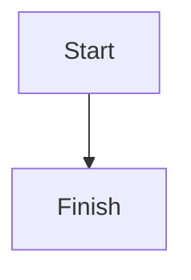

# Wen's Blog

[Wen's Blog](https://zhangwen.site) 的源码仓库，基于 Astro 构建，部署到 Netlify。

## 功能

- 使用 MDX 写文章
- 基于 Tailwind CSS v4 的站点样式
- Expressive Code 代码高亮
- `:::note` / `:::tip` / `:::caution` / `:::danger` 提示块
- Mermaid 图表渲染
- Sandpack 交互式代码示例
- RSS、Sitemap、Tag 页面
- Pagefind 全文搜索
- Light / Dark / Auto 主题切换

## 技术栈

- Astro 6
- TypeScript
- React 19
- Tailwind CSS 4
- MDX
- Pagefind
- Netlify

## 本地开发

先确保本机已安装 `pnpm`。

```sh
pnpm install
pnpm dev
```

常用命令：

```sh
pnpm dev            # 启动开发服务器
pnpm build          # 生产构建，并生成 Pagefind 索引
pnpm build:astro    # 仅执行 Astro 构建
pnpm build:pagefind # 单独生成搜索索引
pnpm preview        # 预览生产构建结果
pnpm lint           # 运行 ESLint
pnpm lint:fix       # 自动修复 lint 问题
pnpm assistant      # 交互式创建博客文章
```

## 内容工作流

博客文章存放在 `content/blog/`，目录约定为：

```text
content/blog/YYYY-MM-DD--slug/index.mdx
```

页面路由使用 frontmatter 里的 `slug`，最终文章地址是：

```text
/{slug}/
```

新建文章最快的方式是运行：

```sh
pnpm assistant
```

这个脚本会收集标题、slug、描述、日期和标签，然后创建文章目录与 `index.mdx`。

## Frontmatter 规范

文章 schema 定义在 `src/content.config.ts`。当前支持这些字段：

```yaml
title: 一篇文章的标题
slug: article-slug
description: 文章摘要
date: 2026-08-24
lastUpdated: 2026-08-24
tags:
  - AI
  - Tool
searchIndex: true
image: https://example.com/cover.png
```

说明：

- `title`、`slug`、`description`、`date`、`lastUpdated`、`tags` 必填
- `image` 可选，用于社交分享图
- `searchIndex` 默认为 `true`
- `tags` 支持直接写字符串，构建时会自动去首尾空格、合并重复空格并去重
- 标签 slug 由 `src/tags.ts` 直接根据标签文本生成
- 如果两个不同标签会生成同一个 slug，构建会直接报错

## 标签管理

标签逻辑集中在 `src/tags.ts`：

```ts
normalizeTagName(tag)
normalizeTags(tags)
getTagSlug(tag)
getTags(entries)
```

新增标签时，直接写进文章 frontmatter 即可。需要额外处理的只有 slug 冲突。

## 自定义 MDX 能力

### Aside

```md
:::note
正文
:::

:::caution[注意]
正文
:::
```

### Mermaid

````md

````

### Playground

````md
<Playground template="react">

```js name=App.js active
export default function App() {
  return <h1>Hello World</h1>
}
```

</Playground>
````

## 关键目录

```text
content/blog/        博客文章
src/pages/           页面与路由
src/components/      站点组件
src/constants.ts     站点标题、导航等全局配置
src/content.config.ts 内容集合 schema
src/tags.ts          标签规范化、slug 生成、聚合与冲突检查
src/remark.ts        自定义 remark 插件
scripts/assistant.ts 文章脚手架脚本
```

## 配置入口

日常最常改的文件：

- `src/constants.ts`：站点标题、描述、导航
- `src/tags.ts`：标签规范化、slug 规则、聚合行为
- `astro.config.ts`：Astro 集成、Markdown 管线、Pagefind 开发态支持
- `netlify.toml`：Netlify 构建与环境变量

## 部署

生产环境通过 Netlify 构建：

```toml
[build]
command = "pnpm build"
publish = "dist"
```

生产环境站点地址配置为 `https://zhangwen.site`。
