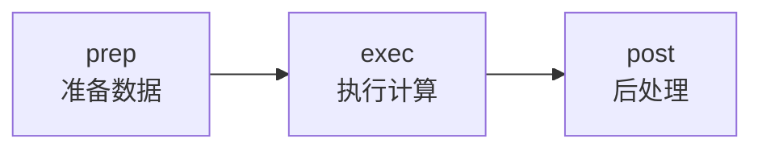
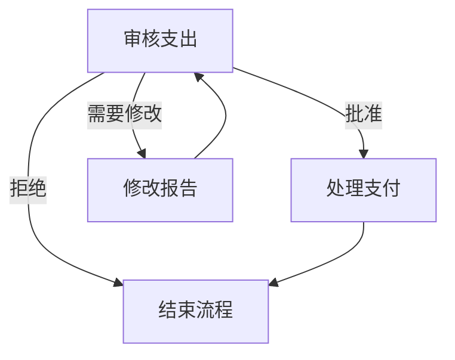

:::note[引用说明]
本文基于 [PocketFlow](https://github.com/the-pocket/PocketFlow) 官方文档整理与延展。
:::

## 什么是 PocketFlow

PocketFlow 是一个仅有 **100 行代码**的极简 LLM（大语言模型）框架。与其他庞大的框架相比，它的设计理念是"少即是多"——只保留核心抽象，零依赖，零供应商锁定。

### 为什么选择 PocketFlow？

| 框架 | 代码行数 | 大小 | 特点 |
|-------|---------|------|------|
| LangChain | 405K | +166MB | 功能丰富但臃肿，依赖众多 |
| CrewAI | 18K | +173MB | 多代理支持，但体积较大 |
| SmolAgent | 8K | +198MB | 轻量，但仍有依赖 |
| AutoGen | 7K | +26MB | 微软出品，功能较多 |
| **PocketFlow** | **100** | **+56KB** | **极简，零依赖，零供应商锁定** |

### PocketFlow 的核心优势

- **极简主义**：只有 100 行代码，可以直接复制使用
- **表达性强**：支持多代理、工作流、RAG 等多种设计模式
- **零依赖**：不需要安装额外的库
- **零供应商锁定**：不绑定任何特定的 LLM 提供商
- **AI 编程友好**：与 Cursor AI 等工具配合，生产力提升 10 倍

## 核心概念

PocketFlow 的核心抽象是 **Graph（图）**，在此基础上实现了 Node（节点）和 Flow（流）两个核心概念。

### 1. Node（节点）

Node 是 PocketFlow 的最小构建块，每个节点遵循 `prep -> exec -> post` 三个步骤：



#### prep 阶段

- **读取和预处理数据**：从 shared store 读取数据
- 示例：查询数据库、读取文件、序列化数据为字符串
- 返回 `prep_res`，供 `exec()` 和 `post()` 使用

#### exec 阶段

- **执行计算逻辑**：这是节点的主要工作
- 示例：调用 LLM、远程 API、工具使用
- ⚠️ **重要**：这里只做计算，不应该访问 shared
- ⚠️ **异常处理**：委托给 Node 内置的重试机制，不要在 `exec()` 中使用 try-except
- 返回 `exec_res`，传递给 `post()`

#### post 阶段

- **后处理和写入数据**：将结果写回 shared store
- 示例：更新数据库、改变状态、记录结果
- **决定下一步行动**：返回一个字符串（action），如 `"default"`（如果返回 None，则视为 default）

:::tip
为什么分三个步骤？为了强制实现**关注点分离**原则。数据存储和数据处理操作分离。
:::

### 2. Flow（流）

Flow 用于编排节点的图结构。根据每个 Node 的 `post()` 返回的 Action 来决定下一个节点。

#### Action-based Transitions

每个 Node 的 `post()` 返回一个 **Action** 字符串，Flow 根据这个 Action 决定下一步：

1. **基本默认跳转**：`node_a >> node_b`
   - 如果 `node_a.post()` 返回 `"default"`，则跳转到 `node_b`

2. **命名 action 跳转**：`node_a - "action_name" >> node_b`
   - 如果 `node_a.post()` 返回 `"action_name"`，则跳转到 `node_b`

#### 创建 Flow 的示例

```python
# 定义流连接
node_a >> node_b

# 创建流并指定起点
flow = Flow(start=node_a)

# 执行流
flow.run(shared)
```

#### 分支和循环

```python
# 支出审批流程的分支示例
review - "approved" >> payment        # 批准后处理支付
review - "needs_revision" >> revise   # 需要修改则返回修改
review - "rejected" >> finish         # 拒绝则结束流程

revise >> review  # 修改后回到审核

# 审批可以形成循环
payment >> finish  # 支付后结束
```



#### 嵌套 Flow

Flow 本身也是一个 Node，这允许强大的组合模式：

```python
# 创建子流
node_a >> node_b
subflow = Flow(start=node_a)

# 将子流连接到另一个节点
subflow >> node_c

# 创建父流
parent_flow = Flow(start=subflow)
```

## 节点间通信

PocketFlow 提供两种通信方式：

### 1. Shared Store（推荐用于几乎所有场景）

- 一个全局数据结构（通常是内存字典），所有节点都可以读写
- 适合：存储数据结果、大内容、多个节点需要访问的信息
- **最佳实践**：使用 Shared Store 来分离**数据模式**和**计算逻辑**

示例：

```python
shared = {
    "user": {
        "id": "user123",
        "context": {
            "weather": {"temp": 72, "condition": "sunny"},
            "location": "San Francisco"
        }
    },
    "results": {}  # 空字典用于存储输出
}
```

### 2. Params（仅用于 Batch 模式）

- 每个节点有一个本地的、临时的 `params` 字典
- 参数键值在节点的运行周期内是**不可变**的
- 适合：标识符如文件名或数字 ID

:::warning
只设置最上层的 Flow 参数，其他的会被父 Flow 覆盖。如果需要设置子节点参数，请参考 Batch 文档。
:::

## 容错和重试机制

PocketFlow 内置了强大的故障容错和重试机制。

### 重试配置

你可以为 Node 启用重试：

- `max_retries`（int）：最大重试次数，默认为 1（不重试）
- `wait`（int）：下次重试前的等待时间（秒），默认为 0

示例：

```python
my_node = SummarizeFile(max_retries=3, wait=10)
```

### 优雅降级

当所有重试都失败后，可以重写 `exec_fallback` 方法来提供降级结果：

```python
class SummarizeFile(Node):
    def exec(self, prep_res):
        # 可能失败的操作
        summary = call_llm(prompt)
        return summary

    def exec_fallback(self, prep_res, exc):
        # 提供简单的降级结果而不是崩溃
        return "处理您的请求时出现错误。"
```

## Agentic Coding 实践

PocketFlow 强调**Agentic Coding**——人类设计，AI 编码的模式。这是一种协作方式：

### Agentic Coding 步骤

| 步骤 | 人类 | AI | 说明 |
|-------|-------|-----|------|
| 1. 需求分析 | ★★★ 高 | ★☆☆ 低 | 人类理解需求和上下文 |
| 2. 流程设计 | ★★☆ 中 | ★★☆ 中 | 人类指定高层设计，AI 填充细节 |
| 3. 工具函数 | ★★☆ 中 | ★★☆ 中 | 人类提供可用的外部 API，AI 帮助实现 |
| 4. 数据设计 | ★☆☆ 低 | ★★★ 高 | AI 设计数据模式，人类验证 |
| 5. 节点设计 | ★☆☆ 低 | ★★★ 高 | AI 帮助设计基于流程的节点 |
| 6. 实现 | ★☆☆ 低 | ★★★ 高 | AI 基于设计实现流程 |
| 7. 优化 | ★★☆ 中 | ★★☆ 中 | 人类评估结果，AI 帮助优化 |
| 8. 可靠性 | ★☆☆ 低 | ★★★ 高 | AI 编写测试用例，处理边界情况 |

### 关键原则

#### 1. 从小处着手

- **保持简单、愚蠢！** 避免复杂功能和全规模类型检查
- **快速失败**：利用内置的 Node 重试和降级机制
- 添加日志以方便调试

#### 2. 人类设计在先

- **如果人类无法指定流程，AI 代理也无法自动化它！** 在构建 LLM 系统之前，通过手动解决示例输入来彻底理解问题，培养直觉。

#### 3. 分离关注点

- **不要在工具函数中做 LLM 任务**：LLM 任务是核心功能，不是工具函数
- 工具函数应该处理：读取输入、写入输出、使用外部工具（如调用 LLM、搜索网页）

## 设计模式

PocketFlow 支持多种常见设计模式：

### 1. Agent 模式

多个智能体协作完成复杂任务。每个 Agent 可以有不同的目标和能力。

### 2. Workflow 模式

将任务分解为多个步骤，按顺序或并行执行。适合写作、数据分析等场景。

### 3. RAG 模式

检索增强生成，将信息检索与文本生成结合，缓解模型"幻觉"问题。

### 4. Multi-Agent 模式

多个 Agent 异步通信，协作解决问题。

### 5. Map-Reduce 模式

批量处理大数据，通过映射和归约两个阶段提高效率。

## 快速开始

### 安装

```bash
pip install pocketflow
```

或直接复制 [源代码](https://github.com/The-Pocket/PocketFlow/blob/main/pocketflow/__init__.py)（只有 100 行）。

### 基础示例

```python
from pocketflow import Node, Flow

class LoadData(Node):
    def post(self, shared, prep_res, exec_res):
        shared["data"] = "Some text content"
        return None

class Summarize(Node):
    def prep(self, shared):
        return shared["data"]

    def exec(self, prep_res):
        prompt = f"Summarize: {prep_res}"
        summary = call_llm(prompt)
        return summary

    def post(self, shared, prep_res, exec_res):
        shared["summary"] = exec_res
        return "default"

load_data = LoadData()
summarize = Summarize()
load_data >> summarize

flow = Flow(start=load_data)
shared = {}
flow.run(shared)
```

## 学习心得

PocketFlow 给我的最大启发是：**极简不等于功能弱**。通过只保留核心抽象，PocketFlow 实现了：

1. **极高的灵活性**：支持任意 LLM 提供商
2. **强大的表达力**：100 行代码支持复杂的多代理协作
3. **优秀的可维护性**：关注点分离使代码清晰易懂

:::tip
如果你想深入学习 LLM 框架设计，PocketFlow 的源代码是最好的学习材料之一。只有 100 行，每行都有其存在的意义。
:::

## 更多资源

- [官方文档](https://the-pocket.github.io/PocketFlow/)
- [GitHub 仓库](https://github.com/the-pocket/PocketFlow)
- [视频教程](https://youtu.be/0Zr3NwcvpA0)
- [Discord 社区](https://discord.gg/hUHHE9Sa6T)

PocketFlow 还有 TypeScript、Java、C++、Go、Rust 和 PHP 版本！
