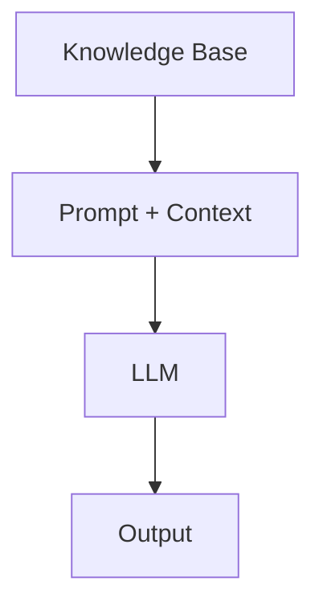
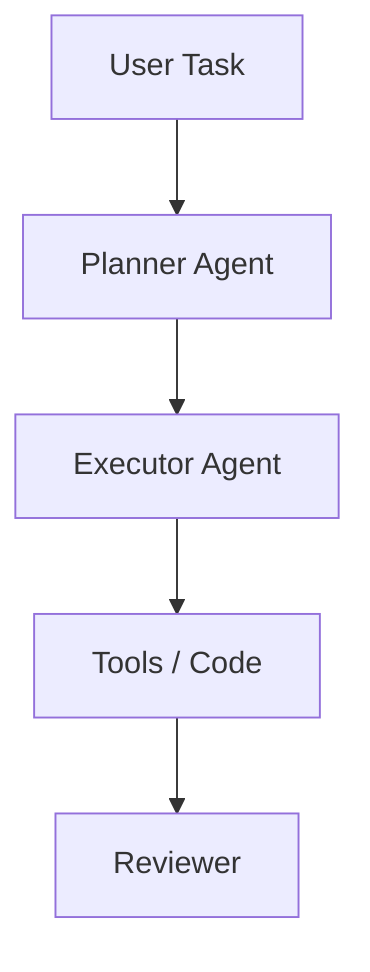
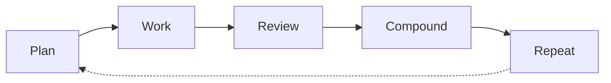
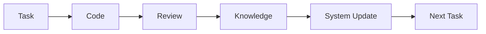
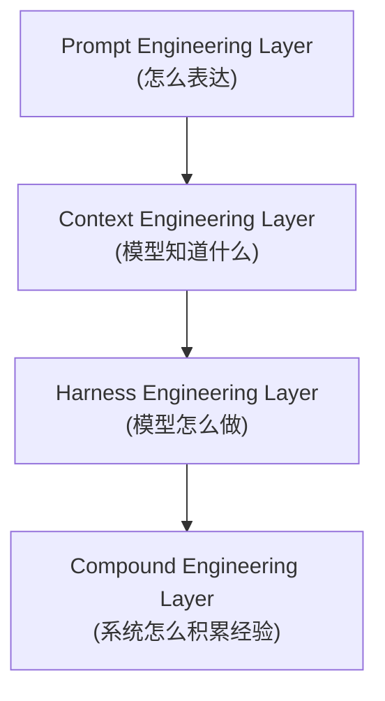

用 AI 写代码，很多人都会经历同一个阶段。

前几周很兴奋，需求一扔，代码很快就出来了，速度像开了外挂。再过一阵子，问题开始冒头：同一个项目里出现几套命名习惯，组件写法来回摇摆，某个坑明明上周才填过，这周又换个地方塌了。

这时候如果把锅全甩给模型，认为肯定是模型降智了，这其实有点不太公平。更准确地说，是我们还在用“单次生成”的方式处理一个需要长期一致性的工程问题。

我想聊的就是这件事，Prompt 很重要，但它只是入口。真正决定系统能不能越用越顺的，是你怎么组织上下文、流程，以及这些经验有没有留下来。

## 为什么 AI Coding 容易越用越乱

原因不复杂：LLM 天生没有长期记忆。

它不记得你上次怎么命名，不知道这个仓库为什么坚持某种分层，也不会天然继承团队上个月刚达成的共识。你这次给它什么，它就围着这次输入展开。对话一关，状态基本清空。

可工程系统不是这么运行的。工程依赖的是连续性：同一类问题最好用同一类解法，架构决策要能追溯，踩过的坑最好别踩第二遍。

把这两件事放在一起，矛盾就很清楚了：

```

LLM = 无状态 + 非确定性
工程系统 = 依赖长期一致性

```

很多团队第一反应是继续打磨 prompt。这当然有帮助，但它解决的是“这一轮回答能不能更像样”，不是“下十轮会不会越来越稳”。

真正的问题其实是另一句：怎么让 AI 参与开发，同时不把代码库带进失控状态？

这事不能只在 prompt 上做文章，得往系统里做。

## 第一层：Prompt Engineering

最早一层大家都熟，逻辑也最直白：

```
input (prompt) -> LLM -> output
```

你给模型角色设定、few-shot 示例、输出格式约束，再补一点思维链引导，单次结果通常会好不少。对日常编码来说，这已经能解决很多问题。

问题在于，它的优化单位始终是“这一轮”。

Prompt Engineering 更像是在调函数参数。你希望这次输出更好，于是把输入写得更清楚。它没有记忆，也没有复用能力。今天让它写出一个很顺手的 React 组件，明天类似需求再来一次，只要上下文稍微变形，结果就可能完全换一种风格。

所以 prompt 很重要，但它解决不了长期一致性。你每次都在重新来过，只是来的方式看起来很专业。

## 第二层：Context Engineering

接着大家会自然往前走一步：既然 prompt 不够，那就给模型更多上下文。

架构就变成了这样：



常见的组件包括 RAG（把文档和代码做成可检索的知识库，调用前先把相关片段塞进去）和 memory（短期的管当前会话，长期的跨 session 沉淀项目规则和偏好）。再加上 tooling，模型不只是读代码，还能查仓库、调接口、跑命令，把"建议"推进到"执行"。

这一层比单纯写 prompt 强很多，因为模型终于开始“知道点东西”了。它知道这个仓库长什么样，知道以前怎么做过，也知道可以用什么工具。

但问题还没彻底解决。你只是把原料喂得更好了，执行模式本身没变。每次任务仍然是一次独立出击，任务之间没有严格的协作，也没有稳定的反馈闭环。

聪明了，但还没形成系统。

## 第三层：Harness Engineering

到了这一层，重点不再是“给模型什么信息”，而是“让它按什么流程做事”。给模型套一个 Harness，不让它跑偏，我个人觉得更准确的叫法是 Workflow Engineering。

典型结构会长成这样：



变化主要在两个地方。一是任务被拆开了，大需求先分成子任务，每个子任务定义输入、输出和验收条件，出错时能定位，返工时也不至于全盘重来。二是角色开始分工，Planner 规划、Executor 落地、Reviewer 找问题。哪怕底层还是同一个模型，这种切分也会让系统稳定不少，因为流程里多了"第二双眼睛"。测试、构建、lint、git 也都接了进来，整个开发流程不再需要人手动收尾。

这已经很像工程了。模型不再只是给代码片段，而是能把一件多步骤任务从头走到尾。

但麻烦仍然会反复出现：上周刚修过的坑，这周还会再犯。原因也很直接，任务虽然跑成了闭环，经验却没有稳定回流到系统里。

任务做完了，但经验没留下来。

## 第四层：Compound Engineering

这一步我觉得最关键，因为它把目标从“完成任务”换成了“让系统变强”。

前三层里，AI 的角色基本都是执行者。Compound Engineering 往前再推一步，要求系统在每次执行后都能吸收经验，影响下一次执行。

它的基本闭环是：



关键就在 Compound 这一步。Review 不是终点。任务做完、问题找完之后，还要再问一句：这次有没有值得沉淀的规则、模式和反例？如果有，就把它写回系统。

经验一旦写回去，下一轮就不是从零开始。

### 先把规划做实

执行阶段的大部分混乱，根源往往在规划。需求边界不清、验收条件含糊、依赖关系没拆出来，后面自然一边写一边猜。

所以我反而建议先把 implementation plan 写细，把 acceptance criteria 写清，把不确定的地方提前暴露出来。规划阶段多花半天，后面可能省掉两天的返工。

### 执行要可追踪、可验证

执行阶段常见的三个机制都很实用：

1. worktree 隔离。每个任务在独立环境里做，互不污染。
2. todo tracking。任务做到哪一步，不靠印象判断。
3. 持续验证。每走完一步就检查，而不是最后一次性开奖。

这些东西听起来不新鲜，但对 Agent 很重要。模型最怕的不是难任务，而是“悄悄偏了还没人告诉它”。

### Review 不要只靠一个视角

我越来越觉得，多 Agent Review 是这套架构里最划算的部分。

传统 code review 的问题在于注意力带宽。一个人同时盯安全、性能、架构、测试和可维护性，注意力一分散，很多问题就溜过去了。

如果把 Review 拆成多个专项视角，事情会好很多。安全 agent 只看风险，性能 agent 只看热点路径，架构 agent 只看边界和依赖，测试 agent 只看覆盖和回归面。最后再汇总结果，质量通常比“一个 reviewer 看全部”稳定得多。

这不是玄学，就是把 review 从单兵作战改成并行会诊。

### 真正的核心：把经验写回系统

Compound 阶段做的事，其实可以说得很朴素：把这次任务里值得留下来的东西，从“人脑里的印象”变成“系统里的规则”。

常见动作一般有四个：

1. 从代码和 review 结果里抽出有效 pattern。
2. 给这些知识加标签和元数据，保证后面找得到。
3. 更新系统规则，让下一次任务默认带上这些经验。
4. 验证这次沉淀是不是噪音，避免把偶然性写成永久规则。

如果把数据流再压缩一点，大概就是：



第一轮结束后，系统多知道一点。第十轮结束后，项目特定知识开始成形。任务做得足够多之后，系统记住的就不只是代码风格，而是团队真的踩过哪些坑、为什么这么约束、什么写法在这个仓库里总会出问题。

这时候 AI 才开始像一个有历史经验的系统，而不是每次都靠临场发挥的外包选手。

## 四层架构放在一起看

如果把前面四层叠起来，大概是这个关系：



前三层管的是这一轮能不能做成。第四层管的是三个月以后你还在不在犯同样的错。长期看，后者更值钱，但短期总是被忽略。

## 落地实践

不用一上来就全面铺开，那不现实。可以先从零开始，搭个最小可用版本：

1. 把常用 prompt 模板化，先保证同类任务输入别漂移。
2. 给仓库接上基础 RAG 和简单 memory，让模型知道项目上下文。
3. 先跑通 Planner、Executor、Reviewer 这条基本工作流。
4. 每次任务结束后，手动把学到的规则写进约束文件，比如 `AGENTS.md`、`CLAUDE.md` 或项目自己的规范文档。

做到这一步，很多“越用越乱”的问题其实已经能压住。

后面再逐步往上加：把 Review 拆成多个专门 agent，把知识沉淀自动化，再做 pattern library，让系统在生成新代码时主动复用历史上的好解法。

Compound 层持续产出的东西远不只是代码，规则文件（`AGENTS.md`、`CLAUDE.md`、Rules）、agent 角色配置、经过验证的 pattern library、Review 记录和失败案例，这些才是系统记忆的载体。没有它们，AI 每次都要重新认识你的项目。

能持续产出稳定代码的系统，比代码本身更值钱。实际操作中很容易忘掉这一点，时间会不自觉地全花在写代码上，而不是维护产出代码的系统上。

AI 不该只被当成牛马工具，把它看成和 CI、测试框架同级的基础设施，你才会自然去考虑上下文、反馈和边界，毕竟牛马也得吃草才能干好活。

其实执行速度被放大之后，系统的缺陷也会跟着放大。以前人写得慢，bug 也出得慢；现在 AI 写得快，塌房也快。这个时候，前期的规划和事后的 Review 反而比编码本身更稀缺。

说到底，Compound Engineering 的核心就是一件事：每次任务结束后多花十分钟，把验证过的经验固化到系统里。差距不会在一两天内体现，但一个月后回头看，就是“每次靠外包临场发挥”和“拥有自己工程记忆”的区别。

## 参考资源

- [Compound Engineering](https://every.to/guides/compound-engineering)
- [Compound Engineering Plugin](https://github.com/EveryInc/compound-engineering-plugin)
