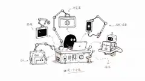
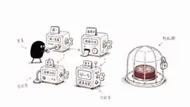

这篇最早是一篇很长的 AI Coding 工作流记录，后来越写越多，工具、Skills、学习资料和一些个人判断全挤在一起。现在把它拆成四篇，这一篇只讲我日常真正会用到的工具，以及哪些工作已经交给 Automation。

系列文章：

1. **工具篇**：当前实际在用的 Agent、浏览器、终端和 Automation
2. [Skills 日常工作流篇](/blog/ai-coding-workflow-2/)
3. [Agent 学习篇](/blog/ai-coding-workflow-3/)
4. [感悟篇](/blog/ai-coding-workflow-4/)

## ChatGPT / Codex

我现在大部分编码任务仍然在 ChatGPT 的 Codex 编程环境里完成。真正省时间的是它能直接进入工程现场：读仓库、执行 Git、测试、构建和 ADB 命令，必要时再配合浏览器、截图或其他工具验证结果。

比较高频的用法有这些：

- 用 worktree 隔离并行任务，避免多个需求互相污染文件状态
- 让 Agent 直接运行测试、构建、lint、ADB 等命令，减少手工往返
- 在主任务旁边开临时对话，讨论替代方案或查一个不想打断主线的问题
- 把未完成的重要对话固定下来，继续长期任务时少找一层上下文
- 通过浏览器或电脑控制检查真实界面，避免只根据代码猜 UI 行为
- 对固定周期的检查和信息整理使用 Automation

### 侧边聊天与独立窗口

侧边聊天适合临时展开一个小问题，例如比较另一种实现方案、解释一个陌生概念、查资料，或者确认一个与主线有关但不值得另开长期对话的问题。

需要同时看主任务和审查结果时，我更常把两个对话放到独立窗口并排显示。两个窗口仍然是独立上下文，这反而比较安全：主任务负责实现，另一个窗口负责审查或资料调查，不会因为共享了一份错误前提而一起跑偏。

### 浏览器与电脑控制

前端开发里，浏览器工具带来的变化很明显。Agent 可以打开本地页面，直接看 DOM、Console、Network、截图和真实交互结果。很多以前需要“截图 -> 描述元素位置 -> 修改 -> 再截图”的事情，现在可以在同一个任务里完成。

电脑控制的价值类似，只是范围从浏览器扩展到桌面应用。适合远程检查开发工具状态、处理需要鼠标和键盘配合的操作。我的原则仍然是每次操作后重新读取当前状态，不把“刚才点过了”当成“现在一定成功了”。

需要把当前进展交给另一轮 Agent 时，我通常会用 [handoff](https://github.com/calvingit/skills/blob/main/global/handoff/SKILL.md) 生成临时交接文档，不指望下一轮自动记住全部细节。

## Pi：独立意见和受限实现

> https://pi.dev

Pi 很轻，纯命令行，模型选择也比较自由。我基于它做了一个 [pi-agent](https://github.com/calvingit/skills/blob/main/global/pi-agent/SKILL.md) Skill，主要用在三个场景：

- **Adviser**：让另一个模型独立给第二意见
- **Committee**：多个模型从不同角度检查同一个问题
- **Implementer**：在明确文件范围和验收条件下完成一个小切片

我用 Pi 时最看重独立性。第一轮审查尽量不把主 Agent 已经形成的结论直接喂给它，否则很容易得到一份更长的附和意见。

涉及实际代码修改时，我还会限制允许修改的文件和验收条件。Pi 返回的 receipt 只能说明它声称做了什么，主 Agent 仍然要看真实 diff、文件状态和验证结果。

## ZCode：移动端远程访问

> https://zcode.z.ai/cn

ZCode 对我最大的吸引力是远程访问方便，移动端 Web 也比较适合临时查看任务。人在外面突然想到一个问题，可以直接从手机进入工作区继续处理，不需要先连回桌面环境。

Hermes Agent、Bot Channel 一类的 IM 接入也解决类似问题：让长时间运行的 Agent 工作区能从不同设备继续访问，而不只是多一个聊天入口。

## CodeGraph：查调用关系

> https://colbymchenry.github.io/codegraph

仓库已经有 `.codegraph/` 索引时，我会优先用 CodeGraph 查符号、调用者和调用路径。它比全文搜索更适合回答下面这些问题：

- 一个方法到底被谁调用
- 某个状态如何跨层传递
- 修改共享函数会影响哪些路径
- 动态分发最后会落到哪个实现

没有索引时就退回 `rg`、`grep` 和直接阅读代码。CodeGraph 是调查工具，不是所有项目都必须先建立的基础设施。

## Context7 与当前文档

> https://context7.com

Flutter、Dart、Vue、Vite、React 这些生态变化很快，涉及 API、配置、迁移和库特有行为时，我会让 Agent 先查当前文档再给方案。

这能避开一个很常见的问题：答案的工程逻辑没错，但 API 名称、参数或版本行为已经变了。对这类问题，我宁可多一次文档查询，也不愿意让模型凭记忆补全。

## Chrome DevTools MCP

> https://github.com/ChromeDevTools/chrome-devtools-mcp

ChatGPT 内置浏览器已经能覆盖很多前端验证任务，但我仍然会保留 Chrome DevTools MCP，主要用于需要本机 Chrome 登录态、扩展或已有标签页的情况。

常见用途包括：

- 打开本地页面并操作真实界面
- 检查 DOM、Console 和 Network
- 截图验证布局和交互
- 复现只有浏览器环境里才出现的问题

这类工具适合交互式调查。需要长期回归的行为，最后还是应该沉淀成 Playwright 等正式测试，不能把“Agent 点过一遍”当成测试体系。

## 终端工具

我同时保留几种终端工具，不强求所有任务都从一个入口完成。

- **herdr**：偏向管理和监控多个 Agent 会话，适合后台持久化任务
- **Warp**：日常终端和 AI 命令辅助
- **Otty**：另一种偏 AI 工作流的终端选择
- **Kimi CLI**：我会在其他 Agent 里以无头方式调用，用于独立执行边界清楚的任务

工具之间有大量能力重叠。我的选择标准很简单：当前任务在哪个环境里最容易拿到真实上下文和验证证据，就在哪个环境里做，没有必要为了统一入口多套一层工具。

## Automation：只自动化边界稳定的工作

我现在只把重复、规则稳定、结果能检查的事情交给 Automation。提交审查、周报、代码健康检查和周期性资料整理比较适合；需求取舍、生产发布、删除数据和高风险代码修改，不会默认无人值守。

一个 Automation 至少要说清三件事：

- **触发**：什么时候运行，使用哪个时间窗口
- **执行**：在哪个项目、什么权限、允许做哪些操作
- **输出**：结果写到哪里，失败和未覆盖项怎么报告

### 本机任务

我目前比较稳定的本机自动化包括：

| 任务 | 主要工作 | 关键边界 |
| --- | --- | --- |
| 每日 commit 质量审查 | 检查当天已提交变更，重点找运行时缺陷 | 只读，不修改、不提交、不推送 |
| 每周代码健康检查 | 回顾最近的重大提交，检查模块边界、重复实现和测试策略 | 独立 worktree，只使用当前证据 |
| 周报总结 | 汇总 Git、任务文档和归档信息 | 使用明确时间窗口，不补造未确认结论 |
| 周期性清理 | 清理已知临时文件和缓存 | 不碰配置、凭据、源码和活跃会话 |

这些任务共同遵循一条规则：先限定范围，再读证据，只执行被授权的动作，最后把结果和 coverage gap 写清楚。Automation 显示成功，只能证明这次流程跑完了，不能证明项目没有问题。

### 云端周期任务

云端任务更适合“定期研究 + 产出”。我现在会用它生成两类 Weekly：

- **Frontend & Mobile Engineering Weekly**：跟踪 Flutter、iOS、Android、React Native、React、Vue、Node、构建工具和代码质量工具的变化
- **AI Software Engineering Weekly**：关注 Coding Agent、Runtime、Skills、MCP、权限、Worktree、评测、可观测性和 AI Developer Infrastructure

这类任务不会直接读取我本地尚未提交的代码，所以信息源和边界与本机 Automation 不一样。它们更适合长期收集公开信息，再整理成带来源的技术文章。

## 工具越多，越需要分清责任

现在能接进 Agent 的工具已经很多了，我不会追求“全部接上”。会长期留下来的，通常是能拿到当前任务真实信息的工具，或者主 Agent 本身缺少的独立能力。

下一篇会继续讲我现在的 [Engineering Skills 日常工作流](/ai-coding-workflow-2/)：什么时候根本不需要 Skill，什么时候进入 `grilling`、`wayfinding`、`to-spec`、`implement`，以及 Runtime Goal、`loop` 和本地 artifact 各自应该负责什么。