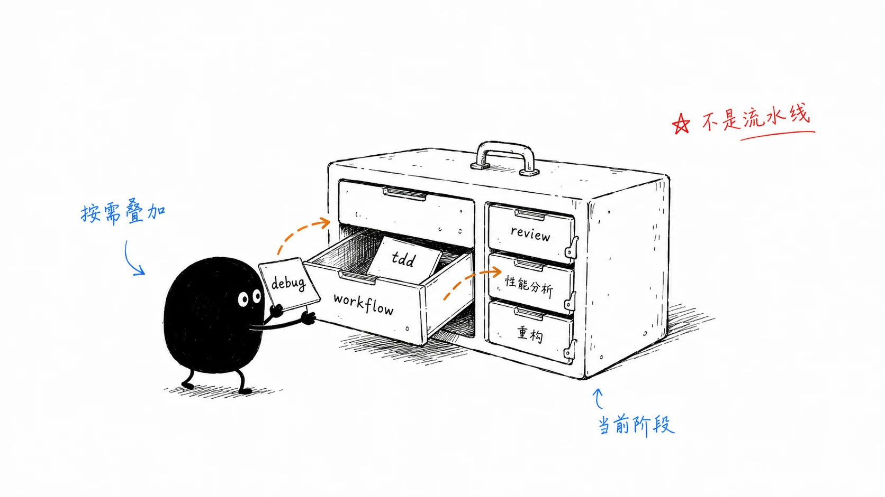
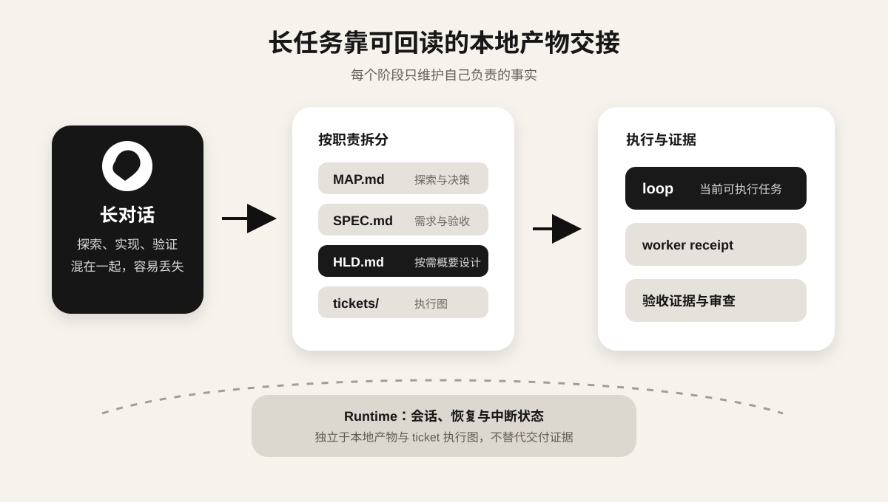
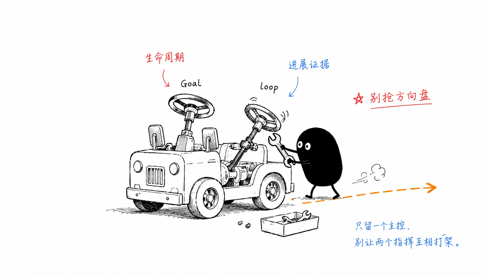

> **更新于 2026-09-03：** 本文根据 Engineering Skills 的最新调整补入按需进行的 `high-level-design`：当多处实现需要共同遵守设计约定时，`HLD.md` 成为需求规范与执行之间的概要设计依据；同时统一为“本地产物”“执行图”“当前可执行任务”“整体交付审查”等中文术语，并更新了交接图。

我前几版 AI Coding 工作流最大的问题，是把开发想成了一条流水线。

那时我会把 `wayfinding -> grilling -> to-spec -> high-level-design -> quick-implement -> simplify -> code-review` 画成一条主流程。实际用久以后发现，这种画法很容易让 Agent 机械执行，明明只是一个局部配置修改，也想先跑一遍 Skill，明明需求已经很清楚，还要从 `wayfinding` 开始，Runtime 已经有 Goal 和 resume，又在 Skill 里套一层自己的循环控制。

最近我把 [Engineering Skills](https://github.com/calvingit/skills#engineering-skills) 重新整理了一遍。现在的思路简单多了，先判断当前任务缺什么，再选负责这一阶段的 Workflow，遇到具体工程问题时按需叠加 Engineering Discipline。Skill 不负责接管完整的软件开发生命周期。

系列文章：

1. [工具篇](/blog/ai-coding-workflow-1/)
2. **Skills 篇**
3. [Agent 学习篇](/blog/ai-coding-workflow-3/)
4. [感悟篇](/blog/ai-coding-workflow-4/)

## 先判断：这个任务真的需要 Skill 吗？

这是现在和以前最大的区别。

下面这些任务，我通常直接处理。

- 一行或很局部的修改
- 简单配置调整
- 明确、低风险的机械性修改
- 只查一个事实或阅读一段代码
- 已经有清晰反馈循环，不需要额外工程方法的任务

Skill 也有成本，会增加上下文、步骤和约束。一个几分钟就能确认的问题，没必要强行塞进完整工作流。

我现在把 Skill 看成一种“在特定工程问题上降低不确定性”的工具。它能明显减少错误率、帮助跨 session 保存关键事实，或者给复杂任务提供更稳定的方法时才值得用。

## 三层上下文

虽然 Skills 的组织方式改了，但全局、项目、任务这三层约束仍然很好用。

### 全局层

全局 `AGENTS.md` 放跨项目长期有效的最低工程规则，例如

- 修改前先理解相关代码和调用关系
- 不覆盖用户已有改动
- 没有验证证据，不声称任务已经成功
- 不擅自 commit、push 或执行破坏性 Git 操作
- 涉及快速变化的 API、SDK、CLI 时先查当前文档

`~/.agents/skills` 则放真正可以跨项目复用的工具型能力，例如 `find-docs`、`pi-agent`、`handoff`、`prompt-optimizer` 和各种委托 Skill。

### 项目层

项目自己的 `AGENTS.md`、架构文档、ADR、领域词汇、测试约定和构建配置才是业务代码的真实边界。

Engineering Skills 不应该把 Flutter、Vue、Node 或某个项目的目录结构硬编码进去。项目里用什么 Repository、怎么跑测试、哪些模块不能互相依赖，这些都应该跟着目标仓库走。

### 任务层

任务只描述这一次真正要解决的问题：目标、范围、验收、限制以及当前已知事实。越接近当前任务的明确要求，优先级越高。

## Engineering Skills

我现在把工程 Skills 分成四类，避免每个 Skill 都同时负责需求、设计、实现、循环和审查。

| 类型 | Skills | 负责什么 |
| --- | --- | --- |
| Project Setup | `project-setup` | 可选地发现项目稳定入口，并把 Engineering Skills Profile 写入 `AGENTS.md` |
| Workflow | `grilling`、`wayfinding`、`to-spec`、`high-level-design`、`to-tickets`、`quick-implement` | 决定当前处于哪个工作阶段，以及应该产出什么本地产物 |
| Engineering Discipline | `debug`、`tdd`、`codebase-design`、`domain-modeling`、`simplify`、`code-review` 等 | 提供某一类工程问题的判断和实践方法 |
| Execution Protocol | `loop` | 消费 ticket 执行图，维护当前可执行任务、执行内部工作单元、聚合证据，并依据进展、重试和无进展规则稳定推进 |

这个分类解决了我之前遇到的重复维护问题，同一套规则不再散落在多个 Skill 里，改一个流程时也不用到处同步。现在每类规则尽量只有一个 owner，Workflow 可以调用 Discipline，但不会再复制一遍它的完整规则。

## Workflow

Workflow 不再有固定起点。我通常先看当前工作卡在哪里。

| 当前状态 | 入口 | 主要产物 |
| --- | --- | --- |
| 产品行为、范围、边界或验收还没谈清楚 | `grilling` | 已确认的需求与决策 |
| 目标大体清楚，但关键技术路径仍有技术迷雾，需要跨 session 探索 | `wayfinding` | `MAP.md` + `decisions/` |
| 需求或 Map 已经确定，需要形成可执行的规范契约 | `to-spec` | `SPEC.md` |
| 已确认的 SPEC 涉及多处实现需要共同遵守的设计约定 | `high-level-design` | `HLD.md` |
| 已有 SPEC 与适用 HLD，且需要多个可独立领取的交付单元、真实 blocker 或持续调度 | `to-tickets` | `tickets/*.md` |
| 已有无需执行图的单一 SPEC | `quick-implement` | 已实现、验证并审查的单次交付 |

这里有几个我现在比较坚持的边界。

### `grilling`

如果用户真正要什么还没确定，或者几个行为选项会实质影响实现，就先把这些决策问清楚。

领域术语和需要长期保留的架构决策，会在同一棵 Design Tree 里交给 `domain-modeling` 处理，不再另开一套重复访谈。

### `wayfinding`

普通任务当然也要先读代码，但这不代表都应该进入 `wayfinding`。

我只在目标已经大体明确、技术路线仍然有持续不确定性，而且需要跨 session 探索时使用它。`MAP.md` 和 `decisions/` 用来保存已经确认的地形、问题和选择，让下一轮 Agent 不必重新猜一遍。

### `to-spec`

现在 `to-spec` 的产物是 `SPEC.md`，不再同时维护一份 `PLAN.md`。

`SPEC.md` 是任务目录中唯一的本地规范快照，回答最终要构建什么、范围在哪里、验收条件是什么。外部 PRD、需求系统或本轮对话可以是上游 requirement authority，但必须先确认并编译为本地 SPEC，不能绕过它直接驱动 tickets 或实现。实现进度、重试状态和 ticket 拆分也不应该混进规范文档，否则需求和执行状态会很快搅在一起。

后续需求新增、修改或删除时，`to-spec` 在同一份 `SPEC.md` 上做 amendment：保留未受影响的 R/AC ID，记录受影响的需求、验收、边界与测试决策。它只评估下游影响，不直接改 ticket；SPEC 确认后，再由 `to-tickets` 协调执行图。

范围明确、能在一个 fresh context 内可靠完成、且不需要执行图的任务，可以把 `SPEC.md` 直接交给 `quick-implement`。是否先写 SPEC 取决于任务是否需要可回读的规范契约；一旦已经有 SPEC，也不意味着必须继续拆 tickets。

### `high-level-design`

`HLD.md` 不是每个任务都要补的一层文档。只有共享类型、模块职责、跨调用方接口、状态或错误语义、依赖方向，或集成迁移约束会让多处实现必须遵守同一份设计约定时，才进入 `high-level-design`。是否需要 HLD 取决于这些约定，而不是 ticket 数量。

它先搜索现有仓库的调用链、相似实现和架构约束，优先复用或扩展已有结构；只有现有结构无法满足 SPEC 时，才采用新增或替换方案。`SPEC.md` 仍只回答需求、外部行为和验收；`HLD.md` 说明在当前代码库里怎样以最小架构偏离满足这些需求；tickets 只负责把工作拆成执行图。

### `to-tickets`

我现在判断要不要拆 ticket，主要看两件事

1. 一个 session 能不能可靠完成
2. 工作之间是否存在真正的独立交付边界和 blocker

只有满足这些条件，才把 `SPEC.md` 拆成 `tickets/*.md`。每张 ticket 是一个可以独立验收的端到端交付任务，不是按文件、目录或“前端一张、后端一张”机械切割。

跨多个 session 本身不是拆分理由。如果工作仍然是一个可控的 scoped task，也可以直接由 `quick-implement` 消费 SPEC；只有需要独立领取、真实 blocker 或统一调度时，tickets 才有价值。

SPEC 或 HLD 的 amendment 确认后，`to-tickets` 才协调受影响的执行图：仍满足当前需求契约的 ticket 和已有证据保留；纯新增行为创建 amendment ticket；原交付契约已经失效的 ticket 标为 `superseded`，并创建 replacement 或 correction ticket。HLD 只调整设计约定时，不应暗中改写已满足的需求验收；应保留原需求证据，并用 correction 或 migration ticket 覆盖受影响的设计决定。不能因为上游变了就把已经 `done` 的 ticket 直接改回 `ready`。只有 SPEC 和 HLD 都未变、整体交付审查发现原契约未满足时，才回到原 ticket 修复。

### `quick-implement`

`quick-implement` 只处理一个已确认、无需执行图且范围明确的 `SPEC.md`：在 fresh context 内重新调查仓库，完成实现、验证与审查，并交付可复核证据。它不创建 ticket、不维护执行图，也不调度其他工作单元。

只要已有 ticket 执行图，无论 active ticket 是一张还是多张，都由 `loop` 按内部 `ticket-worker` 协议选择工作单元。worker 读取上游 SPEC 获得背景与全局约束，但不会把同级 tickets 自动纳入本次范围，也不直接写 ticket 状态、验收勾选或证据。

实现过程中发现新的产品选择、协议变化或验收冲突，说明上游结论需要重新确认。这时应该回到决策或规范阶段，而不是让执行单元当场替用户做决定。

## Engineering Discipline：按问题叠加，不按流程排队

Workflow 确定当前阶段，Discipline 解决阶段里出现的具体工程问题。



| 遇到的问题 | 使用的 Discipline |
| --- | --- |
| 已确认有 bug，需要稳定复现并定位根因 | `debug` |
| 需要判断当前架构是否合理 | `review-architecture` |
| 想主动寻找值得深化的模块边界 | `improve-codebase-architecture` |
| 需要设计 Module、Interface、Seam、Adapter 或依赖方向 | `codebase-design` |
| 术语混乱，或某个架构决策值得长期记录 | `domain-modeling` |
| 行为适合 test-first / red-green 推进 | `tdd` |
| 怀疑存在没有生产 ownership 的抽象、注入点、wrapper 或兼容层 | `simplify` |
| 变更已完成，需要检查项目规范、需求契约和存在时的概要设计 | `code-review` |

这些 Discipline 可以组合，但没有“每次实现后必须全跑一遍”的要求。

比如一个普通行为实现，可能是

```text
quick-implement + tdd -> code-review
```

一个 Bug 修复更像

```text
debug -> reproduction -> root cause -> regression test -> fix
```

架构治理可能是

```text
review-architecture -> codebase-design -> to-spec -> quick-implement
```

而长期复杂度治理，我会单独用 `simplify` 先做 Survey，拿到证据以后再决定是否进入 Change。

这套组合的重点在于当前问题，而不是把所有 Skill 都跑完。

## `simplify`：我现在很重视的一类工程问题

长期使用 Coding Agent 后，我越来越在意一种特殊的代码复杂度，它不一定是传统意义上的坏代码，甚至可能测试齐全、抽象漂亮，但没有真实的生产 ownership。

常见来源包括

- 为了测试方便加入大量 injection point
- 只为某次调试保留的 hook 或 debug state
- 已经没有使用者的 wrapper 和 compatibility path
- AI 为了“更规范”主动引入的抽象层
- 实验功能结束后留下的分支和 adapter

`simplify` 不会根据“像不像 AI 写的”来删代码，它要求先证明这些维护义务已经没有当前生产价值，再在行为不变的前提下删除。

这和我以前“实现后强制跑 simplify”的做法也不一样。现在它是一项按需使用的 Engineering Discipline，先调查 ownership，再决定是否动代码。

## 本地产物才是跨 session 的稳定接口

长任务最容易出问题的地方，是把所有上下文都寄托在当前 session 里。对话压缩几轮以后，细节很容易丢，Agent 又会开始根据残留上下文补全。



我现在让不同阶段只维护自己负责的本地产物。

| 层次 | 本地产物 | 维护者 | 回答的问题 |
| --- | --- | --- | --- |
| 决策探索 | `MAP.md` + `decisions/` | `wayfinding` | 路线还不清楚时，哪些事实和选择已经确认 |
| 需求规范 | `SPEC.md` | `to-spec` | 最终要构建什么、范围和验收是什么 |
| 概要设计 | 按需的 `HLD.md` | `high-level-design` | 多处实现如何遵守共同的模块职责、共享约定和集成约束 |
| 执行图 | `tickets/*.md` | `to-tickets` | 工作怎么拆、哪些 ticket 有真实 blocker |
| 执行证据 | ticket 状态、验收勾选、worker receipt、整体交付审查回执 | `loop` | 当前做到哪里、下一步能做什么、依据是什么 |

下游可以读取上游，但不能静默改写上游。Runtime 的 conversation、session、context recovery 与 interruption persistence 没有列入这张表：它们不属于执行图，也不能替代 ticket Status、acceptance evidence 或当前可执行任务。

例如执行单元发现 SPEC 不成立，正确动作不是顺手把 SPEC 改成当前实现，而是把冲突暴露出来。这个限制看起来麻烦，实际能避免长任务后期出现“代码、计划和最初需求都各自合理，但已经不是同一件事”的情况。

一个比较典型的流转是

```text
需求/边界未定 -> grilling
技术路线有技术迷雾 -> wayfinding -> MAP.md + decisions/
已经确定 -> to-spec -> SPEC.md
多处实现需要共同遵守设计约定 -> high-level-design -> HLD.md
需要多个可独立领取的交付单元、真实 blocker 或持续调度 -> to-tickets -> tickets/ -> loop
范围已明确且一个 fresh context 可完成，且不需要执行图 -> quick-implement
单一 SPEC 的实现完成后 -> 由 quick-implement 完成必要审查
所有 active tickets 完成后 -> loop 执行整体交付审查与集成验证
```

这只是选择关系，不是必须从上到下全部执行的生命周期。

## Runtime 状态和 `loop`：不要混成同一个 orchestrator

这是这一轮 Skills 重构里最重要的边界调整。

很多 Coding Agent Runtime 已经有 Goal、task persistence、pause/resume 和 session recovery。它们保存的是会话生命周期；Skills 需要保存的则是工程交付事实。两类状态相互独立，不能彼此推导。

```text
Runtime
  -> conversation / session / context recovery / interruption persistence

Engineering workflow
  -> SPEC.md / HLD.md（需要时）/ tickets/ / ticket status / receipt / evidence

loop
  -> 读取 tickets/，维护当前可执行任务，按内部 ticket-worker 协议执行工作单元，依据证据判断进展
```



`loop` 既不是 Goal 的替代品，也不是一个普通的“失败就重试”脚本。它在已有 ticket 执行图时工作：读取 `SPEC.md`、存在时的 `HLD.md` 与 ticket 状态，计算当前可执行任务，默认串行地按内部 `ticket-worker` 协议执行一张 ready ticket；完成后再依据 worker receipt 和证据重新计算。

Runtime 仍然拥有用户层面的 conversation、session、context recovery、interruption persistence，以及 workspace 和实际 worker lifecycle。`loop` 只维护执行图、协调 dispatch，并在 SPEC 或 HLD amendment 到来时暂停受影响的新调度，等待调用方回收仍在写入的 worker。它不为了推进进度改写 `What to build`、`Constraints`、`Acceptance criteria` 或 `Blocked by`。如果工程契约需要变更，应回到决策或规范阶段，再由 `to-spec` 与 `to-tickets` 更新受影响的 SPEC 和执行图。

## 验证：模型输出仍然不是证据

无论用了多少 Skill，我最后还是看真实证据。

大致分成四类。

- **静态证据**：代码、调用关系、配置、Git diff
- **自动检查**：单元测试、Widget 测试、lint、静态分析、构建
- **运行时证据**：日志、接口响应、浏览器、真机、ADB
- **外部结果**：CI、后端联调、生产环境

这些证据不能互相冒充。本地测试通过不能说明 CI 或线上已经正常，另一个 Agent 的 review 通过也不能替代真实 diff 和运行结果。

## Worktree 和多 Agent 仍然只是执行手段

复杂功能或并行任务不自动等于需要独立 worktree。只有能证明任务之间需要文件隔离时才创建；默认串行推进一张 ready ticket。并行之前还必须确认 tickets 与 writable surfaces 足够隔离，避免把冲突从 Git 工作区搬到集成阶段。

但 worktree 只能隔离文件，不能隔离设计冲突。多个 Agent 同时修改共享类型、依赖注入、公共配置或同一条核心调用链，仍然可能互相打架。

多 Agent 也一样。我更看重独立调查和职责隔离，而不是数量。`pi-agent`、`claude-coder`、`codex-executor` 这些全局 Skill 可以负责独立意见或受限实现，最后仍然由主 Agent 对照目标项目规则检查真实状态和 evidence。

## 我现在的日常选择方式

如果把上面的内容压成真实工作里的几个判断，大概是这样。

```text
局部、明确、低风险？
  -> 直接做

需求或验收没确定？
  -> grilling

目标清楚，但技术路径需要持续探索？
  -> wayfinding

已经确定，需要形成长期可回读契约？
  -> to-spec

已经有 SPEC，且多处实现需要共同遵守设计约定？
  -> high-level-design
  -> 基于现有代码库形成 HLD.md

需要多个可独立领取的交付单元、真实 blocker 或持续调度？
  -> to-tickets
  -> loop 默认串行调度当前可执行任务

可以在一个 fresh context 内完成，且不需要执行图？
  -> quick-implement
  -> 按问题叠加 debug / tdd / codebase-design / simplify ...
  -> 完成当前范围的验证与审查

已有 ticket 执行图（包括单张 active ticket）？
  -> loop 选择并协调 ticket-worker
  -> 所有 active tickets 完成后，整体交付审查覆盖完整已落地范围

用户会话暂停、恢复或中断？
  -> 交给 Runtime Goal / Task
  -> 不把它写进 SPEC 或 ticket

loop 中的 worker 需要暂停、收回或重新派发？
  -> Runtime / 调用方管理实际生命周期；loop 只维护执行图与 dispatch，不与用户会话状态混用
```

这套方式比我之前那张“完整主流程图”少了很多仪式感，却更贴近真实开发。小问题直接解决，复杂任务才引入结构，需求、设计、执行和证据各有自己的 owner，Agent 也不必靠一份越来越大的 Prompt 记住所有事情。

Engineering Skills 还会继续变化，不过目前我更认可这个方向。Skill 的价值不在数量，也不在把工程流程写得多完整，而在它能不能在正确的时机提供一种稳定、可复查的工程方法。

下一篇是 [Agent 学习篇](/ai-coding-workflow-3/)，主要记录我是怎么从“会用 AI 写代码”逐渐补到 Model、Context、Harness、Runtime、Memory、Skills 和多 Agent 这些概念的。