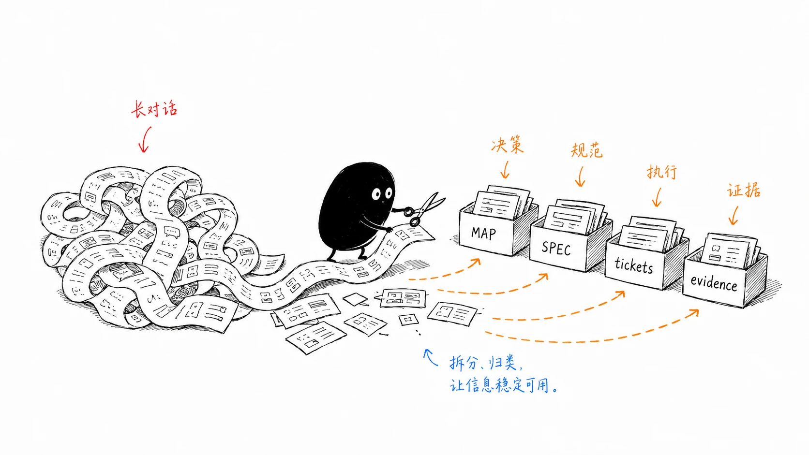

我前几版 AI Coding 工作流最大的问题，是把开发想成了一条流水线。

那时我会把 `wayfinding -> grilling -> architecture -> to-spec -> implement -> simplify -> code-review` 画成一条主流程。实际用久以后发现，这种画法很容易让 Agent 机械执行，明明只是一个局部配置修改，也想先跑一遍 Skill，明明需求已经很清楚，还要从 `wayfinding` 开始，Runtime 已经有 Goal 和 resume，又在 Skill 里套一层自己的循环控制。

最近我把 [Engineering Skills](https://github.com/calvingit/skills#engineering-skills) 重新整理了一遍。现在的思路简单多了，先判断当前任务缺什么，再选负责这一阶段的 Workflow，遇到具体工程问题时按需叠加 Engineering Discipline。 Skill 不负责接管完整的软件开发生命周期。

系列文章：

1. [工具篇](/blog/ai-coding-workflow-1/)
2. **Skills 日常工作流篇**
3. [Agent 学习篇](/blog/ai-coding-workflow-3/)
4. [感悟篇](/blog/ai-coding-workflow-4/)

## 先判断：这个任务真的需要 Skill 吗？

这是现在和以前最大的区别。

下面这些任务，我通常直接处理。

- 一行或很局部的修改
- 简单配置调整
- 明确、低风险的机械性修改
- 只查一个事实或阅读一段代码
- 已经有清晰反馈循环，不需要额外工程方法的任务

Skill 也有成本，会增加上下文、步骤和约束。一个几分钟就能确认的问题，没必要强行塞进完整工作流。

我现在把 Skill 看成一种“在特定工程问题上降低不确定性”的工具。它能明显减少错误率、帮助跨 session 保存关键事实，或者给复杂任务提供更稳定的方法时才值得用。

## 三层上下文仍然保留

虽然 Skills 的组织方式改了，但全局、项目、任务这三层约束仍然很好用。

### 全局层

全局 `AGENTS.md` 放跨项目长期有效的最低工程规则，例如

- 修改前先理解相关代码和调用关系
- 不覆盖用户已有改动
- 没有验证证据，不声称任务已经成功
- 不擅自 commit、push 或执行破坏性 Git 操作
- 涉及快速变化的 API、SDK、CLI 时先查当前文档

`~/.agents/skills` 则放真正可以跨项目复用的工具型能力，例如 `find-docs`、`pi-agent`、`handoff`、`prompt-optimizer` 和各种委托 Skill。

### 项目层

项目自己的 `AGENTS.md`、架构文档、ADR、领域词汇、测试约定和构建配置才是业务代码的真实边界。

Engineering Skills 不应该把 Flutter、Vue、Node 或某个项目的目录结构硬编码进去。项目里用什么 Repository、怎么跑测试、哪些模块不能互相依赖，这些都应该跟着目标仓库走。

### 任务层

任务只描述这一次真正要解决的问题：目标、范围、验收、限制以及当前已知事实。越接近当前任务的明确要求，优先级越高。

## Engineering Skills 分成四类

我现在把工程 Skills 分成四类，避免每个 Skill 都同时负责需求、设计、实现、循环和审查。

| 类型 | Skills | 负责什么 |
| --- | --- | --- |
| Project Setup | `project-setup` | 可选地发现项目稳定入口，并把 Engineering Skills Profile 写入 `AGENTS.md` |
| Workflow | `grilling`、`wayfinding`、`to-spec`、`to-tickets`、`implement` | 决定当前处于哪个工作阶段，以及应该产出什么 artifact |
| Engineering Discipline | `debug`、`tdd`、`codebase-design`、`domain-modeling`、`simplify`、`code-review` 等 | 提供某一类工程问题的判断和实践方法 |
| Execution Protocol | `loop` | 约束 progress、evidence、iteration、retry 和 no-progress，不重复 Runtime 的生命周期能力 |

这个分类解决了我之前遇到的重复维护问题，同一套规则不再散落在多个 Skill 里，改一个流程时也不用到处同步。现在每类规则尽量只有一个 owner，Workflow 可以调用 Discipline，但不会再复制一遍它的完整规则。

## Workflow：看当前最大的未知是什么

Workflow 不再有固定起点。我通常先看当前工作卡在哪里。

| 当前状态 | 入口 | 主要产物 |
| --- | --- | --- |
| 产品行为、范围、边界或验收还没谈清楚 | `grilling` | 已确认的需求与决策 |
| 目标大体清楚，但关键技术路径仍有 Fog of war，需要跨 session 探索 | `wayfinding` | `MAP.md` + `decisions/` |
| 需求或 Map 已经收敛，需要形成可执行的规范契约 | `to-spec` | `SPEC.md` |
| 已有 SPEC，但一个 fresh session 无法可靠完成，需要拆独立执行单元 | `to-tickets` | `tickets/*.md` |
| 实现边界已经清楚 | `implement` | 已实现并验证的代码变更 |

这里有几个我现在比较坚持的边界。

### `grilling` 解决需求和决策未定

如果用户真正要什么还没收敛，或者几个行为选项会实质影响实现，就先把这些决策问清楚。

领域术语和需要长期保留的架构决策，会在同一棵 Design Tree 里交给 `domain-modeling` 处理，不再另开一套重复访谈。

### `wayfinding` 不是“先读代码”的代名词

普通任务当然也要先读代码，但这不代表都应该进入 `wayfinding`。

我只在目标已经大体明确、技术路线仍然有持续不确定性，而且需要跨 session 探索时使用它。`MAP.md` 和 `decisions/` 用来保存已经确认的地形、问题和选择，让下一轮 Agent 不必重新猜一遍。

### `to-spec` 只负责规范契约

现在 `to-spec` 的产物是 `SPEC.md`，不再同时维护一份 `PLAN.md`。

`SPEC.md` 回答的是最终要构建什么、范围在哪里、验收条件是什么。实现进度、重试状态和 ticket 拆分都不应该混进规范文档，否则需求和执行状态会很快搅在一起。

### `to-tickets` 不是“大任务就拆票”

我现在判断要不要拆 ticket，主要看两件事

1. 一个 fresh session 能不能可靠完成
2. 工作之间是否存在真正的独立交付边界和 blocker

只有满足这些条件，才把 `SPEC.md` 拆成 `tickets/*.md`。每张 ticket 是一个可以独立验收的 vertical slice，不是按文件、目录或“前端一张、后端一张”机械切割。

### `implement` 只实现已经确认的东西

实现阶段可以更新 ticket 的状态、验收勾选和 evidence，但不能为了让代码继续往前写，偷偷修改 `What to build`、`Constraints` 或 `Acceptance criteria`。

如果实现过程中发现新的产品选择、协议变化或验收冲突，说明上游结论需要重新确认。这时应该回到决策或规范阶段，而不是让实现 Agent 当场替用户做决定。

## Engineering Discipline：按问题叠加，不按流程排队

Workflow 确定当前阶段，Discipline 解决阶段里出现的具体工程问题。


| 遇到的问题 | 使用的 Discipline |
| --- | --- |
| 已确认有 bug，需要稳定复现并定位根因 | `debug` |
| 需要判断当前架构是否合理 | `review-architecture` |
| 想主动寻找值得深化的模块边界 | `improve-codebase-architecture` |
| 需要设计 Module、Interface、Seam、Adapter 或依赖方向 | `codebase-design` |
| 术语混乱，或某个架构决策值得长期记录 | `domain-modeling` |
| 行为适合 test-first / red-green 推进 | `tdd` |
| 怀疑存在没有生产 ownership 的抽象、注入点、wrapper 或兼容层 | `simplify` |
| 变更已完成，需要检查项目规范和需求契约 | `code-review` |

这些 Discipline 可以组合，但没有“每次实现后必须全跑一遍”的要求。

比如一个普通行为实现，可能是

```text
implement + tdd -> code-review
```

一个 Bug 修复更像

```text
debug -> reproduction -> root cause -> regression test -> fix
```

架构治理可能是

```text
review-architecture -> codebase-design -> to-spec -> implement
```

而长期复杂度治理，我会单独用 `simplify` 先做 Survey，拿到证据以后再决定是否进入 Change。

这套组合的重点在于当前问题，而不是把所有 Skill 都跑完。

## `simplify`：我现在很重视的一类工程问题

长期使用 Coding Agent 后，我越来越在意一种特殊的代码复杂度，它不一定是传统意义上的坏代码，甚至可能测试齐全、抽象漂亮，但没有真实的生产 ownership。

常见来源包括

- 为了测试方便加入大量 injection point
- 只为某次调试保留的 hook 或 debug state
- 已经没有使用者的 wrapper 和 compatibility path
- AI 为了“更规范”主动引入的抽象层
- 实验功能结束后留下的分支和 adapter

`simplify` 不会根据“像不像 AI 写的”来删代码，它要求先证明这些维护义务已经没有当前生产价值，再在行为不变的前提下删除。

这和我以前“实现后强制跑 simplify”的做法也不一样。现在它是一项按需使用的 Engineering Discipline，先调查 ownership，再决定是否动代码。

## Artifact 才是跨 session 的稳定接口

长任务最容易出问题的地方，是把所有上下文都寄托在当前 session 里。对话压缩几轮以后，细节很容易丢，Agent 又会开始根据残留上下文补全。



我现在让不同阶段只维护自己负责的 artifact。

| 层次 | Artifact | Owner | 回答的问题 |
| --- | --- | --- | --- |
| 决策探索 | `MAP.md` + `decisions/` | `wayfinding` | 路线还不清楚时，哪些事实和选择已经确认 |
| 规范契约 | `SPEC.md` | `to-spec` | 最终要构建什么、范围和验收是什么 |
| 执行图 | `tickets/*.md` | `to-tickets` | 工作怎么拆、哪些 ticket 有真实 blocker |
| 执行证据 | ticket 状态、验收勾选、receipt、Runtime state | `implement` / Runtime / `loop` | 当前做到哪里，下一步依据是什么 |

下游可以读取上游，但不能静默改写上游。

例如 `implement` 发现 SPEC 不成立，正确动作不是顺手把 SPEC 改成当前实现，而是把冲突暴露出来。这个限制看起来麻烦，实际能避免长任务后期出现“代码、计划和最初需求都各自合理，但已经不是同一件事”的情况。

一个比较典型的流转是

```text
需求/边界未定 -> grilling
技术路线有 Fog -> wayfinding -> MAP.md + decisions/
已经收敛 -> to-spec -> SPEC.md
需要跨 sessions 执行 -> to-tickets -> tickets/
边界明确 -> implement
完成后 -> code-review
```

这只是选择关系，不是必须从上到下全部执行的生命周期。

## Runtime Goal 和 `loop`：不要做两个 orchestrator

这是这一轮 Skills 重构里我改动比较大的地方。

现在很多 Coding Agent Runtime 已经有 Goal、task persistence、pause/resume、session recovery 等能力。既然 Runtime 能可靠保存生命周期，Skill 层就没必要再造一套“继续、暂停、恢复、checkpoint”。

我的职责划分是：

```text
Runtime Goal / Task
  -> lifecycle / persistence / pause / resume / recovery

loop protocol
  -> evidence / progress invariant / iteration / retry / no-progress

Engineering Skills
  -> implement / tdd / debug / simplify / code-review ...
```


所以 `loop` 现在不是 Goal 的替代品，也不是一个普通的“失败就重试”脚本。

外层 Runtime 已经负责 continue、stop 和 checkpoint 时，`loop` 只提供执行协议。只有 Runtime 缺少可靠的长期任务能力，而且任务确实需要多轮推进时，它才承担最小的 execution control。

我会避免在一个已经有 Goal 的任务里再套一个拥有相同职责的 nested loop。两个 orchestrator 都觉得自己负责生命周期，最后往往是状态重复、停止条件冲突，出了问题也很难判断谁应该恢复。

## 验证：模型输出仍然不是证据

无论用了多少 Skill，我最后还是看真实证据。

大致分成四类。

- **静态证据**：代码、调用关系、配置、Git diff
- **自动检查**：单元测试、Widget 测试、lint、静态分析、构建
- **运行时证据**：日志、接口响应、浏览器、真机、ADB
- **外部结果**：CI、后端联调、生产环境

这些证据不能互相冒充。本地测试通过不能说明 CI 或线上已经正常，另一个 Agent 的 review 通过也不能替代真实 diff 和运行结果。

## Worktree 和多 Agent 仍然只是执行手段

复杂功能、并行任务和外部 Agent 实现，我仍然倾向放进独立 worktree。它能隔离文件状态，也方便主 Agent 检查每个执行者实际改了什么。

但 worktree 只能隔离文件，不能隔离设计冲突。多个 Agent 同时修改共享类型、依赖注入、公共配置或同一条核心调用链，仍然可能互相打架。

多 Agent 也一样。我更看重独立调查和职责隔离，而不是数量。`pi-agent`、`claude-coder`、`codex-executor` 这些全局 Skill 可以负责独立意见或受限实现，最后仍然由主 Agent 对照目标项目规则检查真实状态和 evidence。

## 我现在的日常选择方式

如果把上面的内容压成真实工作里的几个判断，大概是这样。

```text
局部、明确、低风险？
  -> 直接做

需求或验收没收敛？
  -> grilling

目标清楚，但技术路径需要持续探索？
  -> wayfinding

已经收敛，需要形成长期可回读契约？
  -> to-spec

一个 fresh session 做不完，而且存在独立交付和真实 blocker？
  -> to-tickets

可以实现？
  -> implement
  -> 按问题叠加 debug / tdd / codebase-design / simplify ...
  -> 需要时 code-review

长任务生命周期？
  -> 优先交给 Runtime Goal
  -> loop 只补执行协议或 Runtime 缺失的最小控制
```

这套方式比我之前那张“完整主流程图”少了很多仪式感，却更贴近真实开发。小问题直接解决，复杂任务才引入结构，需求、设计、执行和证据各有自己的 owner，Agent 也不必靠一份越来越大的 Prompt 记住所有事情。

Engineering Skills 还会继续变化，不过目前我更认可这个方向。Skill 的价值不在数量，也不在把工程流程写得多完整，而在它能不能在正确的时机提供一种稳定、可复查的工程方法。

下一篇是 [Agent 学习篇](/ai-coding-workflow-3/)，主要记录我是怎么从“会用 AI 写代码”逐渐补到 Model、Context、Harness、Runtime、Memory、Skills 和多 Agent 这些概念的。