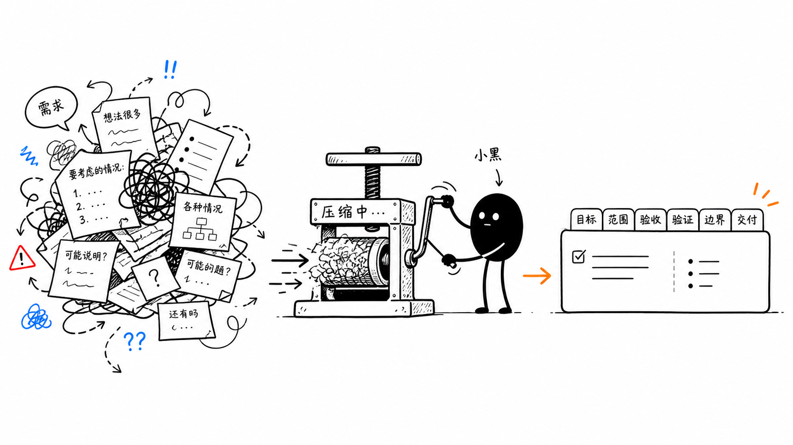
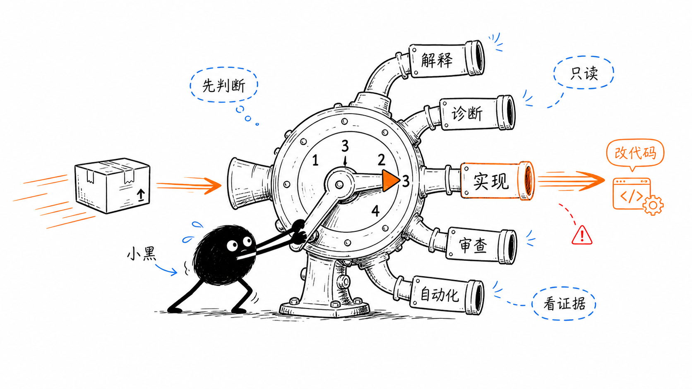
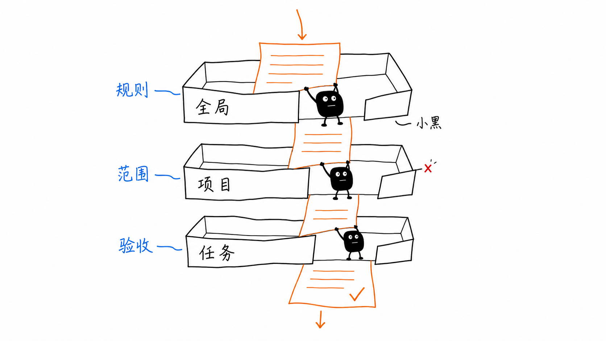
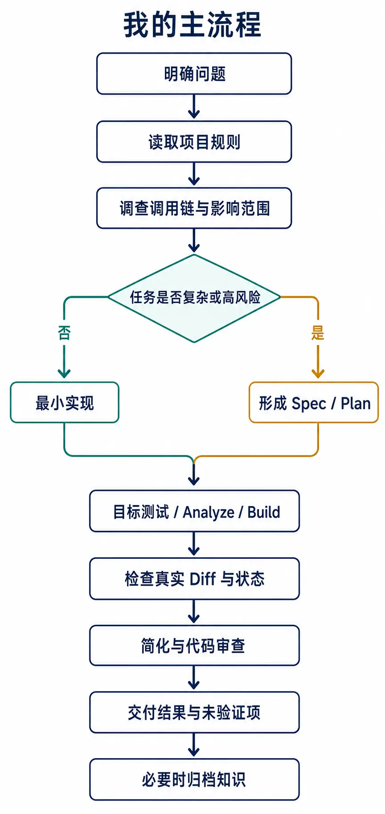
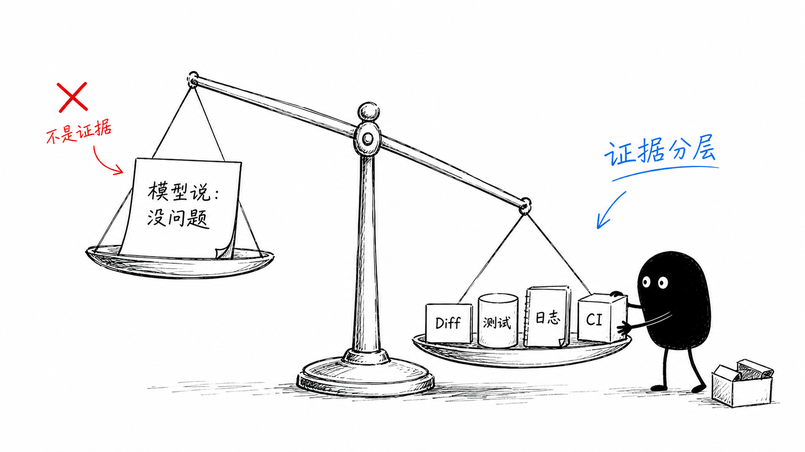
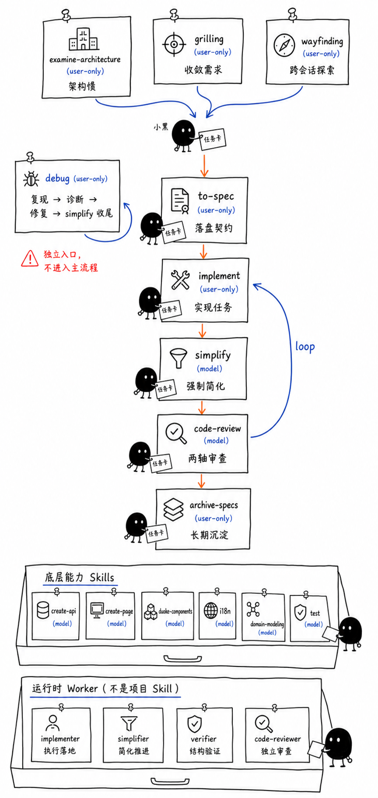
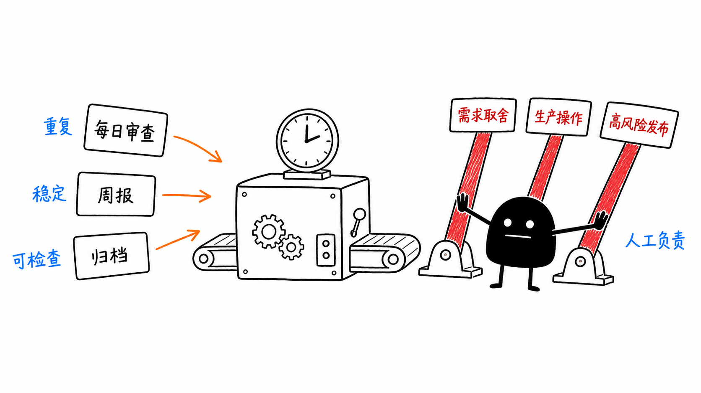

一开始，我只是用 AI 查 API、解释报错、生成代码片段。后来，我开始把完整的研发任务交给 Agent：让它读取项目、调查调用链、修改代码、运行验证，再根据结果继续推进。

这时我逐渐发现，真正影响结果的不是某一次提示词写得多漂亮，而是项目上下文、任务边界、工具权限和验证方式是否清楚。

这篇文章记录我目前正在形成的一套工作方式：我如何使用 Agent 工具，如何学习 Agent，如何把全局规则和项目 Skills 放进日常研发流程，以及哪些工作适合自动化。我不打算做工具测评，也不想给出一套必须照抄的标准答案，这只是现阶段的工作记录。

全文分为五部分：工具应用、Agent 学习路线、日常工作流、自动化，以及最近形成的一些判断。

## 一、Agent 工具的应用

### 1. ChatGPT

OpenAI 将 Codex 改名为 ChatGPT，品牌统一了，增加了 Work 模式。我主要还是用 Codex 编程模式，一般不切换到 Work 模式。

对我最有用的是：

- 让 Agent 执行 Git、测试、构建、ADB 等命令，避免手动在终端敲命令
- 尽量使用 worktree 隔离上下文，减少任务之间的干扰，可以同时对一个仓库并行多个需求开发
- 内置了各种好用的插件， 支持第三方插件接入
- 记忆功能挺强，几个月前的内容还记得
- 一些周期性重复工作可以交给自动化定期执行

下面聊几个大部分人不常用，但是我用起来很爽的功能：

#### 侧边聊天

侧边聊天会共享主对话的上下文，但本身是临时的：侧边对话关闭后，内容不会保留，也无法再找回来对话。

适合在主对话旁边临时展开一个小话题，常用场景包括：

- 探讨另一种实现方案
- 解释一个陌生名词或概念
- 搜索和整理资料
- 随手确认一个不想打断主线的问题

#### 内嵌浏览器：前端开发调试

内嵌浏览器让 Agent 直接面对真实页面完成调试，而不只是阅读代码或猜测效果。它可以打开本地页面，使用鼠标点选组件，给多个元素批量打标签，再把这些标注和修改要求一起发回对话。

这对前端迭代尤其方便：可以边看页面边指出具体问题，要求 Agent 同时调整一组组件，再通过截图、页面操作、Console 和 Network 检查修改结果。设计、实现和验证都在同一个任务里完成，减少了手动描述元素、来回切换工具和复制报错信息的成本。

#### 对话新窗口与分屏

可以在对话列表对对话右键，选择 **在新窗口打开**，再用 macOS 或 Windows 的系统窗口排列将两个对话并排或分屏。这样适合把主任务和审查、资料或验证对话同时放在屏幕上；两个窗口仍是独立对话，不能把一个窗口的上下文自动当成另一个窗口的上下文。

#### 复制深度链接

复制对话的深度链接，可以另开一个对话读取原对话内容，用于交接工作或继续处理任务。但我最近需要把当前进展交给新的 Agent 时，通常使用 `handoff` SKILL 生成临时文档。

#### 置顶对话

把常用或未完成的重要对话置顶，方便后续检索。自动化任务也可以选择置顶对话，这样每次执行都会在同一个对话里运行，持续保留任务上下文。

#### 电脑控制

电脑控制把 Agent 变成远程操作员：它可以读取本地应用的当前状态，点击、输入、滚动、拖拽和选择内容，代替人在电脑前完成一系列界面操作。适合远程查看和操作开发工具、控制Chrome浏览器及其他桌面应用；每次操作后重新检查界面状态，再决定下一步，能处理需要鼠标和键盘配合的任务。

### 2. ZCode：远程查看和控制任务

> 官方网站：https://zcode.z.ai/cn

ZCode 是个可选项，用它是因为智谱对自己的GLM系列模型比较数据，能够更好的优化和缓存Token使用。

另一个用它的原因是它的远程连接非常好，不需要代理，解决随时有个想法发给它来处理一下的问题，重点是web移动端适配比较好。

当然也可以使用类似龙虾和 Hermes Agent 的 IM 连接方式，也可以通过 Bot Channel 从微信或者飞书进入工作区，更适合较长时间的移动访问。

### 3. Pi

> 官方网站：https://pi.dev

Pi 是开源的，非常简洁，内置插件不多，要什么功能自己跟AI说。纯命令行操作，可以对接各个厂商的模型。

我基于它做了一个 [pi-agent](https://github.com/calvingit/skills/blob/main/global/pi-agent/SKILL.md) skill，用于替代 Codex 或者 zcode内置的 Sub Agent 功能。

这个skill主要包含以下模式，可以自行去扩展：

- **Adviser**：让另一个模型独立给出第二意见；
- **Committee**：多个模型从不同角度交叉检查；
- **Implementer**：在干净 worktree 和明确文件范围内实现一个小切片。

使用方法：

- 第一轮独立审查尽量不把主 Agent 的结论喂给它
- 长任务先做最小 preflight，确认模型、权限和工具链可用
- 默认串行调用，避免供应商并发和限额问题
- 实现任务必须限制允许修改的文件和验收条件
- Pi 的 receipt 只是声明，主 Agent 仍要检查真实状态、diff 并重新验证

### 4. CodeGraph

> 官方网站：https://colbymchenry.github.io/codegraph

当仓库已经建立 `.codegraph/` 索引时，Agent会优先用 CodeGraph 查符号、调用者和调用路径。相比单纯全文搜索，它更适合回答：

- 这个方法是谁调用的
- 一个状态如何跨层传递
- 修改共享函数会影响哪些路径
- 动态分发后真正落到哪个实现

没有索引时，再退回 `rg` / `grep` 和直接阅读代码。是否建立索引由项目决定，不强制所有仓库使用。

### 5. Context7

> 官方网站：https://context7.com，免费，但是需要注册账号拿到API Key。

Flutter、Dart、Vue、Vite、React 等生态变化很快，涉及 API 语法、配置、版本迁移和库特有问题时，我会让 Agent 先查当前文档，再给方案。

这能减少一个常见问题：模型给出的答案逻辑上合理，但 API 已经改名、废弃或只适用于旧版本。

### 6. chrome-devtools-mcp

> 官方网站：https://github.com/ChromeDevTools/chrome-devtools-mcp

这个 Chrome 开发者工具的 MCP 浏览器工具主要用于本地 Web 验证：

- 打开本地页面并操作真实界面
- 共享已有登录状态
- 检查 Console、Network 和页面元素
- 截图验证布局和交互
- 复现只有浏览器环境才出现的问题

我通常优先使用 ChatGPT 应用内置 Browser；需要已有 Chrome 登录态、扩展或现有标签页时，再控制本机 Chrome。可重复回归和 CI 场景仍然应该沉淀为 Playwright 等正式测试。

### 7. 终端工具

常用的终端工具有：

- **herdr**：一款专为 AI 时代设计的轻量级终端多路复用工具（类似 AI 版 tmux），它的核心功能是管理和监控多个 Agent，提供后台持久化会话、鼠标原生交互以及 Agent 状态实时追踪
- **Warp**：闭源转开源了，带 AI 能力的终端，用于生成、解释和整理命令，减少查命令和手动拼接参数的时间；
- **Otty**：Typora 团队的另一款 AI 终端工具
- **Kimi**：配置了 `kimi-k3`，可以用无头模式在其他Agent里来运行

## 二、Agent 学习路线

我没有时间把电子书或视频从头看到尾，大部分时候是在一点点补齐对 Agent 的理解，查缺补漏，挑挑拣拣。

### 1. 先会使用工具

从和大模型对话问答、代码生成、文档查询和错误解释开始，先建立对 Agent 能力边界的直觉。

### 2. 再理解 Agent 如何工作

慢慢理解 Model、Context、Agent Loop、Tool、Harness、RAG、Memory 这些基本组成。

### 3. 从单次问答转向完整交付

学习把请求写成目标、范围、成功标准、禁止事项和验证方式，让 Agent 处理一个可以验收的工程任务。

### 4. 学习上下文工程

把项目规则、真实代码、调用关系、历史决策和工具结果放在一起，理解上下文如何影响 Agent 的判断。

### 5. 学习把稳定步骤固化成 Skills

当一个流程重复出现，并且入口、权限和验证方式已经稳定时，再把它整理成可复用的 Skill。

### 6. 再引入多 Agent 和自动化

从单 Agent 到工具调用、Skills、多 Agent 独立审查，再到有边界的自动化，一层层增加复杂度。

## 三、日常工作流

本章节介绍我在真实项目里如何使用 Skills 驱动的研发流程。

经过一年的时间变化，其实版本迭代了无数个。跟随着AI 模型 和 Agent 的发展，从 Prompt、Context、Harness、Loop、Graph 等各种Engineering概念吸收精华，依照自己的理解和项目需要进行变更。

### 1. 从需求到交付

#### 从"问答案"转向"交付任务"

早期使用 AI，更多是问语法、查资料、生成代码片段。现在我更常把一个完整但有边界的任务交给 Agent，例如：

- 根据异常堆栈追踪真实调用链，定位根因
- 修改 Flutter、Vue 或 Node 项目，并补最小必要测试
- 审查当天提交、近 100 条提交或某个功能分支
- 分析线上日志，输出带证据的分类报告
- 设计发布流程、项目 Skills 和 Agent 协作契约
- 调用浏览器、ADB、截图或本地服务验证真实行为
- 整理文档、报告、信息图和分享材料
- 把重复工作变成定时任务

这里的变化是：输入不再只是"帮我写一段代码"，而是尽量包含：

```text
目标：最终要解决什么问题
范围：允许检查和修改哪些模块
成功标准：什么结果才算完成
验证：需要运行哪些检查
边界：哪些操作不能做，哪些事实不能猜
```



#### 不同任务使用不同模式

##### 解释与调研

适合了解某段代码、比较方案、查询最新文档，默认只读，不直接改代码。

##### 诊断

适合线上日志、崩溃堆栈、网络问题和状态异常，要求沿调用链、配置链和数据流定位根因，不把报错行直接当作根因。

##### 实现

适合边界清楚的功能和 Bug 修复，Agent 可以修改代码，但必须控制 diff，并执行与风险匹配的验证。

##### 审查

重点找运行时缺陷、行为回归、边界遗漏和验证缺口，审查阶段默认只读，避免一边改一边改变证据现场。

##### 自动化

适合固定周期、规则稳定、输出可检查的工作，目前我会把每日提交审查、每周代码健康检查、周报和已完成 Spec 归档等任务交给自动化执行。



---

### 2. Skills 驱动的工作流

Agent执行过程中大概有三层约束：全局、项目、任务。

**全局**

创建 `~/.codex/AGENTS.md`，存放跨项目长期有效的偏好，例如：

- 默认中文、结论先行
- 修改前先理解调用关系
- 保留用户已有改动
- 不擅自 commit、push 或执行破坏性命令
- 没有验证证据就不能声称成功
- 涉及开源库最新 API 时查询当前文档

这相当于给所有 Agent 设置一套最低工程标准。

还有用户级别的skills目录： `~/.agents/skills`，这里放通用的、跨项目的skills，后面有提到。

**项目**

项目仓库内的 `AGENTS.md`、Rules文档和 Skills

项目层描述真实的工程约束，例如：

- 项目结构、模块边界和代码风格
- Flutter、Vue、后端各自的验证命令
- 哪些目录可以修改
- Spec、实现、审查、归档怎样衔接
- 项目特有的业务规则和例外
- 提交日志规范
- 单元测试规范

项目规则应该跟着仓库走，避免团队流程依赖某个人电脑上的全局配置。

**任务**

任务层只描述这次工作的目标、范围和验收标准，越接近当前任务的明确规则，优先级越高。



### 3. 我的 AI Coding 流程



这条流程不是要求每个小改动都写一套文档，简单、低风险、可回滚的任务直接完成即可，只有复杂或高影响任务才进入 Spec / Plan。

#### 复杂任务

复杂需求最容易出现的问题，是 Agent 在需求仍然模糊时就开始写代码。

我的做法是先把下面几件事说清楚：

- 用户真正想解决的问题是什么
- 哪些行为必须保持不变
- 影响哪些模块、接口和状态
- 验收条件如何映射到测试或可观察结果
- 哪些风险需要提前验证

然后再拆成尽量独立的垂直切片，每个切片都应该能说明：改了什么、为什么、怎么验证、还缺什么。

#### Bug 修复

报错堆栈、日志和用户描述通常只是症状，真正修改前，我会要求 Agent：

1. 找到入口和直接调用者
2. 追踪状态、配置或数据从哪里产生
3. 检查相邻调用路径是否也受影响
4. 找到所有路径共同经过的最小修复点
5. 留下一个能防止回归的最小验证

一个共享入口上的正确保护，通常比在多个页面分别加判断更小、更可靠。

#### 验证闭环

模型输出不是证据，我通常看四类证据：

- **静态证据**：代码、调用关系、配置、Git diff
- **自动检查**：单元测试、Widget 测试、静态分析、lint、构建
- **运行时证据**：日志、接口响应、浏览器、真机、ADB
- **外部结果**：CI、后端联调、生产环境

这些层级不能互相造假，比如本地测试通过，不等于线上、CI 已经验收；另一个模型说"没问题"，也不等于真实 diff 和测试没有问题。



#### Git Worktree

把并行工作的风险隔离开，复杂功能、并行任务和外部 Agent 实现，尽量放到独立 worktree：

- 每个任务有独立文件状态
- 主工作区已有修改不会被覆盖
- 可以清楚检查每个 Agent 的实际 diff
- 失败任务可以保留现场，不污染主分支

但 worktree 只隔离文件，不会自动解决共享设计冲突。多个 Agent 同时修改依赖注入、公共配置或共享类型，仍然应该串行处理。

### Skills

`AGENTS.md` 适合放原则，Skill 适合放一个具体任务的操作手册，把稳定流程变成可复用能力。

我现在更关注 Skill 的**触发条件、输入输出契约、权限边界和失败处理**，而不只是里面写了多少提示词。

#### 用户级别 Skills

`~/.agents/skills` 当前包含 19 个有效 Skill。

用户级别 Skills 不绑定某个仓库，适合跨项目复用：

| Skill                          | 用途                                                                                |
| ------------------------------ | ----------------------------------------------------------------------------------- |
| [claude-coder](https://github.com/calvingit/skills/blob/main/global/claude-coder/SKILL.md) | 把明确的编码、重构或测试任务委托给 Claude Code，返回后由主 Agent 检查实际 diff。 |
| [codex-reviewer](https://github.com/calvingit/skills/blob/main/global/codex-reviewer/SKILL.md) | 使用 Codex CLI 做分析、执行或续跑，并对 CLI 输出做批判性复核。 |
| [find-docs](https://github.com/calvingit/skills/blob/main/global/find-docs/SKILL.md) | Context7 查询开源库、SDK、CLI 的当前官方文档；先解析库 ID，再查具体概念。 |
| [fuck-my-shit-mountain](https://github.com/calvingit/skills/blob/main/global/fuck-my-shit-mountain/SKILL.md) | 按指定模式做大范围、对抗式的工程审查；默认不会自动触发。 |
| [pi-agent](https://github.com/calvingit/skills/blob/main/global/pi-agent/SKILL.md) | 路由 Pi 的 adviser、committee、implementer 模式，做独立意见、多模型审查或受限实现。 |
| [kimi-worker](https://github.com/calvingit/skills/blob/main/global/kimi-worker/SKILL.md) | 用户明确要求时，调用 Kimi CLI 完成一个边界清楚的实现任务。 |
| [prompt-optimizer](https://github.com/calvingit/skills/blob/main/global/prompt-optimizer/SKILL.md) | 把目标、上下文、边界、输出和验收条件整理成更稳定的提示词。 |
| [teach](https://github.com/calvingit/skills/blob/main/global/teach/SKILL.md) | 在当前工作区内用循序渐进的方式讲解一个新概念或技能。 |
| [handoff](https://github.com/calvingit/skills/blob/main/global/handoff/SKILL.md) | 把当前对话压缩成可交接的上下文，便于另一个 Agent 继续。 |
| [resolving-merge-conflicts](https://github.com/calvingit/skills/blob/main/global/resolving-merge-conflicts/SKILL.md) | 处理正在进行的 merge/rebase 冲突，保持冲突边界和 Git 状态可见。 |
| [humanizer-zh](https://github.com/calvingit/skills/blob/main/global/humanizer-zh/SKILL.md) | 去除中文文档中的 AI 味、翻译腔和模板化表达，同时保留事实与责任主体。 |
| [tavily-search](https://github.com/calvingit/skills/blob/main/global/tavily-search/SKILL.md) / [tavily-cli](https://github.com/calvingit/skills/blob/main/global/tavily-cli/SKILL.md) | 做一次性网页搜索或通过 CLI 查询文章、新闻和资料。 |
| [tavily-extract](https://github.com/calvingit/skills/blob/main/global/tavily-extract/SKILL.md) | 从指定 URL 提取干净正文，适合已有链接的定向阅读。 |
| [tavily-crawl](https://github.com/calvingit/skills/blob/main/global/tavily-crawl/SKILL.md) / [tavily-map](https://github.com/calvingit/skills/blob/main/global/tavily-map/SKILL.md) | 批量抓取站点内容，或先发现一个站点的 URL 结构。 |
| [tavily-dynamic-search](https://github.com/calvingit/skills/blob/main/global/tavily-dynamic-search/SKILL.md) | 用程序化调用筛选搜索结果，只把决策所需的信息带回上下文。 |
| [tavily-research](https://github.com/calvingit/skills/blob/main/global/tavily-research/SKILL.md) | 做多来源、带引用的深度研究和比较报告。 |
| [tavily-best-practices](https://github.com/calvingit/skills/blob/main/global/tavily-best-practices/SKILL.md) | 在代码中集成 Tavily 搜索、抽取、爬取和研究能力时提供实现规范。 |
| [url-to-markdown](https://github.com/calvingit/skills/blob/main/global/url-to-markdown/SKILL.md) | 把公开网页转换为本地 Markdown，供后续阅读、翻译或归档。 |

这些能力的组合通常是：`find-docs` 负责官方技术资料，`tavily-*` 负责外部搜索研究，`prompt-optimizer` 负责把任务写清楚，`pi-agent` 或 `claude-coder` 负责独立执行，`handoff` 负责跨对话交接，主 Agent 最后负责证据核对。

#### 项目 Skills

项目 Skills 绑定业务应用的目录、架构和验证规则，是真正进入业务代码时的主流程。从 Skill这个概念开始到现在已经改了10几个版本了，包括很多流行的工作流Skills（Superpows， addyosmani/agent-skills等等）。

最近爱上了`mattpocock/skills`，在项目里用了几个月之后，挺适合我的，然后就魔改成了以下的版本：

| Skill                  | 用途                                                              |
| ---------------------- | ----------------------------------------------------------------- |
| [wayfinding](https://github.com/calvingit/skills/blob/main/engineering/wayfinding/SKILL.md) | 先定位模块、入口、规则和相关文档，建立任务地图。 |
| [grilling](https://github.com/calvingit/skills/blob/main/engineering/grilling/SKILL.md) | 通过连续追问收敛需求、范围、取舍和验收条件。 |
| [examine-architecture](https://github.com/calvingit/skills/blob/main/engineering/examine-architecture/SKILL.md) | 在实现前检查模块边界、依赖方向、状态所有权和架构风险。 |
| [domain-modeling](https://github.com/calvingit/skills/blob/main/engineering/domain-modeling/SKILL.md) | 维护领域术语表和 ADR，避免同一业务概念在不同模块各说一套。 |
| [to-spec](https://github.com/calvingit/skills/blob/main/engineering/to-spec/SKILL.md) | 将已经收敛的需求落盘为 `SPEC.md` 和 `PLAN.md`。 |
| [implement](https://github.com/calvingit/skills/blob/main/engineering/implement/SKILL.md) | 按 Spec/Plan 选择 task unit，实现 feedback loop，并完成集成验证。 |
| `create-page`          | 按项目约定创建 Flutter 页面、路由和必要的 ViewModel。             |
| `create-api`           | 从接口契约生成 Dart Model、Repository、Mock，并完成 DI 接入。     |
| `app-components`       | 复用项目已有的业务 UI 组件和设计约定。                            |
| [debug](https://github.com/calvingit/skills/blob/main/engineering/debug/SKILL.md) | 建立复现、假设、验证、修复、回归的 Bug 排查闭环。 |
| `test`                 | 为关键业务逻辑编写或运行 Flutter 单元/Widget/集成测试。           |
| [simplify](https://github.com/calvingit/skills/blob/main/engineering/simplify/SKILL.md) | 在行为不变的前提下收缩 diff、删除过度设计，实现和修复后强制执行。 |
| [code-review](https://github.com/calvingit/skills/blob/main/engineering/code-review/SKILL.md) | 以只读方式审查运行时缺陷、回归风险、调用链和验证证据。 |
| `i18n`                 | 按项目翻译源文件、Key 约定和生成流程维护多语言资源。              |
| [loop](https://github.com/calvingit/skills/blob/main/engineering/loop/SKILL.md) | 对已落盘的 Spec/Plan 自动循环执行到收尾，需要显式授权。 |
| `archive-specs`        | 读取真实代码和验证证据，把已完成任务沉淀为模块级 living spec。    |

项目内还有一个重要设计：Skill 不只是"提示词合集"，而是带有入口检查、允许修改范围、验证命令、输出格式和失败处理的操作契约。

**项目 Skills 组合起来怎么用**



##### 新需求或大功能

```text
wayfinding
  -> grilling
  -> examine-architecture / domain-modeling
  -> to-spec
  -> implement
  -> test + simplify
  -> code-review
  -> archive-specs
```

如果需求还没有收敛，不直接进入 `to-spec`；如果只是一个很小、低风险的修改，也不强行走完整链路。

##### 新增页面

```text
wayfinding -> grilling -> create-page
           -> app-components
           -> test（仅在存在关键交互或状态逻辑时）
           -> simplify -> code-review
```

页面 Skill 负责结构和入口，组件 Skill 负责复用视觉能力，测试和审查负责行为证据。

##### 新增接口

```text
wayfinding -> grilling -> create-api
           -> test（Model / Repository / 关键映射）
           -> simplify -> code-review
```

接口变更先确认真实 API 契约和现有 `DkHttpClient`/Repository 模式，再生成 Model，避免只根据一段示例 JSON 编代码。

##### Bug 修复

```text
wayfinding -> debug -> test（先复现或补最小回归）
           -> implement（若需要跨文件修改）
           -> simplify -> code-review
```

`debug` 负责找到根因，`implement` 负责按边界落地；不能把"排查"和"顺手重构整个模块"混成一件事。

##### 高风险或有争议的实现

```text
主 Agent 调查
  -> pi-agent adviser / committee（独立意见）
  -> 主 Agent 决策
  -> implement 或受限 pi-agent implementer
  -> 主 Agent 重新检查 diff 与验证
```

全局 Skill 负责外部协作，项目 Skill 负责业务实现。两者组合时，项目规则仍然是代码修改的最终边界。

---

## 四、自动化

### 1. 什么可以自动化？

我只把重复、规则稳定、结果能检查的工作交给自动化。提交审查、周报和归档符合这几个条件；需求取舍、生产发布、删除数据和高风险代码修改不应该默认无人值守。

每个自动化都应该留下时间窗口、实际范围、执行命令、输出结果、失败原因和未覆盖项。没有这些字段，定时任务只是定时生成一段看起来合理的文字。

我把自动化拆成三个维度：

- **触发**：什么时候运行，按本地时间还是云端时间；
- **执行**：在哪个项目、哪个 worktree、用什么模型和权限运行；
- **输出**：结果写到哪里、是否通知、失败时如何报告。

本地自动化可以读取本机仓库和工具，但会受到电脑开机、权限、网络、依赖和服务状态影响。云端自动化不依赖本机是否开机，更适合提醒、资料整理和周期性汇总，但通常不能直接读取本地未提交代码或本地登录态。

### 2. 当前本机可核实的自动化

| 名称                            | 类型与时间                     | 做什么                                                                                       | 边界                                                                                          |
| ------------------------------- | ------------------------------ | -------------------------------------------------------------------------------------------- | --------------------------------------------------------------------------------------------- |
| 每天 commit 质量审查            | 本地项目定时任务；工作日 23:00 | 检查当天所有本地可见 refs 上的已提交变更，按 SHA 去重，重点找真实运行时缺陷。                | 只读；不修改、格式化、生成、暂存、提交或推送；只运行必要的 targeted tests。                   |
| 每周代码健康/架构偏移检查       | 本地项目定时任务；周一 08:00   | 回顾当前作者过去 7 天的重大提交，检查模块边界、重复实现、状态复杂化和测试策略风险。          | 独立 worktree；只读；不把旧 automation memory 当作当前证据。                                  |
| 每周归档已完成任务 Spec         | 本地项目定时任务；周一 07:00   | 检查 `docs/tasks/`，只把已有实现和验证证据的任务归档为模块级 living spec。                   | 不因超过 30 天就自动标记完成；不删除 task 目录；缺证据就列为 skipped/stale。                  |
| 周报总结                        | 本地项目定时任务；周五 17:30   | 汇总所有分支和 worktree 的 Git、任务文档与归档文档，生成需求任务、代码优化、工程化三类周报。 | 使用精确时间窗口；正文不展开代码细节；未确认的结论要标记。                                    |
| 双周清理 ChatGPT 应用缓存与日志 | 本地心跳；每两周周日           | 执行清理脚本，把超过 14 天的已知临时/缓存项移入废纸篓。                                      | 不永久删除；不动配置、凭据、Skills、sessions、worktrees、源码以及正在使用的 `logs_2.sqlite`。 |

这几项任务都按同一套做法运行：先限定范围，再读证据，只执行被授权的动作，最后写清结果和 coverage gap。自动化显示成功，只能说明这次任务按规则跑完，不代表项目没有风险。



### 3. 本机自动化提示词

以下为当前本机自动化实际使用的提示词（不含"周报总结"）。

#### 每天 commit 质量审查

```text
在 `/Users/xxx/xxx` 审查当天 00:00:00（Asia/Shanghai）至运行时刻、所有本地可见 refs 上的已提交变更；按 SHA 去重，统一审查，不按 branch 分组。无提交则直接输出"无变更"。

先读 `AGENTS.md` 和 `docs/skills/skill-context.md`，遵守其中的范围/证据规则，但以本任务目标和输出契约为准。只读变更文件、直接调用方/被调用方、相关类型和已有测试，不扩展为全仓库审查。

重点检查运行时风险：Widget 生命周期与 dispose 后回调、异步竞态和 await 后 BuildContext、Timer/Stream/Controller/监听器释放、状态 owner/缓存/UI 不同步、空值/默认值/序列化/接口兼容、重复导航/错误恢复/请求幂等、iOS/Android/Web 分支和路径差异。每个 finding 必须有文件位置、可达调用路径、失败场景、影响和代码/测试证据。排除纯风格、lint 可直接发现、无具体失败场景的猜测；不因缺少测试单独立项。

只在与变更直接相关时运行 targeted tests；不运行全量测试、`flutter analyze` 或架构守卫。严禁修改、格式化、生成、暂存、提交或推送文件。

固定输出：`result`、`scope`、`findings`（仅有问题时）、`verification`、`coverage_gap`。
```

#### 每周代码健康/架构偏移检查

```text
在 `/Users/xxx/xxx` 的独立 worktree 中，审查当前作者过去 7 天内 HEAD 可达的重大代码提交，识别代码健康、架构偏移、模块边界侵蚀、重复实现、状态/数据流复杂化、测试策略缺口和高风险设计。每日近 24 小时运行时检查负责缺陷发现，本任务不重复它，也不读取其 memory。

只以当前仓库状态和本次命令输出为事实；不修改、格式化、生成、暂存、提交或推送文件。先读 `AGENTS.md`、`docs/skills/skill-context.md`、`.agents/skills/debug/SKILL.md`。通过 `git config user.name/email` 获取作者；缺少则报告 blocker，不猜测。无符合条件的提交则输出无近期作者提交。

按提交规模、跨模块影响、公共 API/类型、状态所有权、数据流、构建/发布路径、平台分支、依赖和测试策略筛选重大提交，快速排除纯文档/配置微调/局部低风险修复。只读候选提交、变更文件、直接调用方/被调用方、相关类型、spec、测试和必要架构文档，不扩展为全仓库审查。

每个问题必须有文件位置、提交/diff 证据、可达调用/状态/数据流、风险场景、影响，以及根因层面的最小解决方案、验证计划和迁移/兼容风险。排除纯风格、无具体失败/演进场景的猜测、lint 可直接发现的问题；测试缺口仅在会掩盖具体高风险变化时报告。仅运行只读或不改变工作区的最小必要命令，并在前后记录工作区状态。

发现问题时输出 `result`、`scope`、`findings`、最多 3 个 `excluded_candidates`、`verification`、`coverage_gap`；无问题时输出 `result`、`scope`、最多 3 个 `checked_candidates`、`other_candidates`、`verification`、`coverage_gap`。无缺口写 `none`。
```

#### 每周归档已完成任务 Spec

```text
扫描当前仓库 `docs/tasks/`，使用 `archive-specs` skill 归档已经实现且有验证证据的任务。

先读 `.agents/skills/archive-specs/SKILL.md`。仅处理具备 `SPEC.md`+`PLAN.md`（或 skill 允许的 legacy 输入）、代码已实现且有测试/review/git/doc 证据的任务。方案阶段、实现不完整、验证失败、关键证据缺失或 ownership 不明的任务列入 `skipped`，说明原因。

超过 30 天的任务必须判定状态，但不得仅按年龄归档、删除或标记 implemented。年龄优先取目录名 `YYYY-MM-DD`，否则取 `createdDate` 或首次 Git 提交时间，并说明依据；状态仅可为已实现、进行中、已取消或已被替代。无法可靠判定的列入 `stale_tasks`，写明年龄、已查证据、缺失信息和建议动作。

归档前检视实际代码和证据。按需写入/更新 `docs/archived-specs/` 模块级 implemented living spec、`docs/api/` 和 README；不要删除、移动或重命名 `docs/tasks/<date>-<name>/`，只提示后续可清理的目录。未提交变更可作为判断依据，但必须说明涉及文件。

固定输出：`archived`、`skipped`、`stale_tasks`（无则 `none`）、`verification.executed`、`verification.evidence_read`、`follow_up`（无则 `none`）。
```

### 4. ChatGPT Web 里的两个云端自动化

这两个任务运行在 ChatGPT Web 的云端"已安排"列表中，不依赖本机是否开机，也不读取本地未提交代码。它们更像"定期研究 + 产出 + 发布"的远端 Agent，而不是本地代码检查脚本。

#### `Frontend & Mobile Engineering Weekly`

- **频率**：每周一上午；当前页面显示下次运行时间为 4 天后。
- **目标**：汇总过去一周真正影响工程决策的前端和移动端进展，并准备发布到 `https://github.com/calvingit/blog`。
- **覆盖**：React、Vue、Node、构建工具、UI 生态、代码质量工具，以及 Flutter、iOS、Android、React Native。
- **信息优先级**：官方文档、Release Notes、官方博客和 GitHub 一手记录优先；社区内容只用于发现线索，必须二次验证。
- **输出**：中文技术分析，说明影响范围、破坏性变更、迁移成本、对现有项目的实际影响和行动建议。

#### `AI Software Engineering Weekly`

- **频率**：每周五下午；当前页面显示下次运行时间为明天。
- **目标**：生成面向资深工程师的 AI 软件工程分析文章。
- **核心视角**：不按新闻时间线罗列事件，而是先提出本周工程判断，再用事实支撑判断。
- **关注范围**：Coding Agent、Agent Runtime、planning/delegation/multi-agent、Skills/Rules、MCP、权限与安全、Worktree、评测、可观测性和 AI Developer Infrastructure。
- **证据要求**：区分已验证事实、来源观点和工程分析；优先使用官方文档、源码、Release Notes、论文和 benchmark；社区内容不能作为唯一事实依据。
- **文章要求**：讨论为什么成立、可能被高估的地方、限制和反方观点；外部事实使用 Astro/MDX footnote，并集中定义参考资料。
- **提示词**：

```markdown
每周生成一份 **AI Software Engineering Weekly**。

面向有经验的软件工程师，分析过去一周真正影响软件工程决策的 AI 变化。不要按厂商或时间线罗列新闻，先提炼工程判断，再用证据支撑；没有足够重要的主题时可以少写，不要为了周更制造趋势。

要求：

- 区分已验证事实、来源观点和工程分析，不把推断写成事实。
- 优先使用官方文档、Release Notes、源码、论文和 benchmark；社区内容只用于发现线索，事实需继续追溯。
- 对每个判断检查反例、技术限制、成本、维护负担，以及是否值得普通团队现在投入。
- 重点关注 Coding Agent、Agent Runtime、Planning/Delegation/Multi-agent、Skills/Rules、MCP、权限与安全、Worktree/Sandbox、评测、可观测性、可靠性，以及 AI 对开发、测试、审查和 CI/CD 的影响。

信息来源优先级：官方一手资料 > 论文与 benchmark > 高质量工程实践 > 社区信号。每期只选择少量有工程价值的内容。

固定输出：本期判断、证据与链接、限制和反方观点、对工程团队的影响、行动建议、未验证项。
```

这两个云端任务的共同点是：**长期运行、持续研究、先做判断、保留来源、再生成对外内容**；它们和本机自动化的区别在于，本机任务有文件系统和项目命令访问能力，云端任务更适合周期性信息生产与远端协作。

---

## 五、最近的感悟

### 1. 上下文工程比提示词技巧更重要

稳定效果通常来自项目规则、真实代码、调用关系、历史决策、验收标准和工具权限。只改一条 prompt，补不上缺失的上下文。

### 2. 多 Agent 的价值是独立性，不是数量

多个 Agent 同意，并不天然代表结论正确。如果它们共享了同一份错误前提，只会更一致地犯错。

多 Agent 更适合：

- 独立调查后交叉验证；
- 按文件或垂直切片隔离实现；
- 让实现者、验证者和审查者承担不同角色。

不适合让多个 Agent 同时修改公共配置、共享类型或同一条核心调用链。

### 3. 自动化的前提是边界稳定

我会自动化重复、规则明确、结果可检查的任务，例如每日提交审查和每周健康检查；不会把需求决策、生产操作或高风险发布默认交给无人值守任务。

自动化要留下：执行范围、时间窗口、真实输出、失败原因和未覆盖项。没有这些，自动化只是定时生成一段文字。

### 4. 记忆应该保存决策，不应该保存幻觉

长期记忆适合记录稳定的项目约定、已经验证的命令和容易重复踩坑的边界。对版本、分支、服务状态和外部接口等易变化信息，仍然需要现场复查。

### 5. 最小改动不是少读代码

最小改动要建立在充分理解之上。为了让 diff 看起来小而跳过调用链调查，通常只是把第二个 Bug 留给以后。

我理想中的 Agent 是：**先把问题看完整，再用最少的代码解决它。**

### 6. 最终责任仍然在人

Agent 可以调查、修改、验证和汇报，但需求取舍、风险接受、生产操作和对外承诺仍然需要人负责。

我不追求"完全无人参与"，我更希望把人的注意力从重复操作移到：

- 目标是否正确
- 证据是否充分
- 风险是否可以接受
- 这个改动是否真的值得存在

---

## 参考资料

我自己收藏的一些资料，建议按"先理解运行机制，再接入工具"的顺序阅读。

### Agent 学习

| 资料                                             | 在线入口                                                                                                                                                             |
| ------------------------------------------------ | -------------------------------------------------------------------------------------------------------------------------------------------------------------------- |
| Introduction to Agents                           | [Kaggle 白皮书](https://www.kaggle.com/whitepaper-introduction-to-agents)                                                                                            |
| Agent Tools & Interoperability with MCP          | [Kaggle 白皮书](https://www.kaggle.com/whitepaper-agent-tools-and-interoperability-with-mcp)                                                                         |
| Context Engineering: Sessions & Memory           | [Kaggle 白皮书](https://www.kaggle.com/whitepaper-context-engineering-sessions-and-memory)                                                                           |
| Agent Quality                                    | [Kaggle 白皮书](https://www.kaggle.com/whitepaper-agent-quality)                                                                                                     |
| Prototype to Production                          | [Kaggle 白皮书](https://www.kaggle.com/whitepaper-prototype-to-production)                                                                                           |
| 5-day Generative AI Intensive Course with Google | [Kaggle 课程总览](https://www.kaggle.com/learn-guide/5-day-agents)                                                                                                   |
| Agentic Design Patterns                          | [作者代码仓库](https://github.com/DanieleSalatti/AgenticDesignPatterns) / [图书信息](https://www.amazon.com/Agentic-Design-Patterns-Hands-Intelligent/dp/3032014018) |
| Agent Design Patterns Blueprint                  | [Agent Design Pattern Catalogue](https://research.csiro.au/ss/science/projects/agent-design-pattern-catalogue)（相关设计模式资料）                                   |
| Hello-Agents                           | [datawhalechina/hello-agents](https://github.com/datawhalechina/hello-agents)                                                                                        |
| The Complete Guide to Building Skills for Claude | [Anthropic 官方 PDF](https://resources.anthropic.com/hubfs/The-Complete-Guide-to-Building-Skill-for-Claude.pdf)                                                      |
| AI Agents: Complete Course（Marina Wyss）        | [原文：Medium](https://medium.com/data-science-collective/ai-agents-complete-course-f226aa4550a1)                                                                    |

**如何开始？**

不用一开始就搭建完整体系，可以先从一个小闭环开始：

1. 写一份简短的项目 `AGENTS.md`，只放真实且长期有效的规则
2. 选择一个低风险 Bug，让 Agent 先调查调用链，再做最小修改
3. 明确要求它运行一个能证明行为的检查
4. 自己检查最终 diff，不以 Agent 的总结代替代码
5. 把重复出现三次以上的稳定流程，再整理成 Skill 或自动化

先把一个可靠闭环跑通，再考虑多 Agent、记忆和自动化。工具可以慢慢加，但是验证边界要从第一天就定下来。

---

#### 最近半年 GitHub Star 筛选

半年时间关注了 349 个仓库， 当然大部分是吃灰的，只是方便自己搜索。下面只补充与 Agent 工程学习直接相关、且能补足现有资料的项目。

| 方向                    | 项目                                                                                     | 适合学习什么                                                  |
| ----------------------- | ---------------------------------------------------------------------------------------- | ------------------------------------------------------------- |
| Agent Runtime           | [Apache Maka](https://github.com/apache/maka)                                            | 本地优先工作区、工具调用、权限决策、事件溯源和终止事件。      |
| Agent Runtime / Harness | [OpenHands](https://github.com/OpenHands/OpenHands)                                      | AI 驱动开发 Agent 的运行时和工程化实现。                      |
| Harness                 | [learn-harness-engineering](https://github.com/walkinglabs/learn-harness-engineering)    | 从 0 到 1 理解 Coding Agent Harness。                         |
| 评测                    | [OpenAI Evals](https://github.com/openai/evals)                                          | LLM 和 Agent 系统的评测框架与基准注册表。                     |
| 评测 / 安全             | [promptfoo](https://github.com/promptfoo/promptfoo)                                      | Prompt、Agent、RAG 的测试、红队和回归比较。                   |
| MCP                     | [GitHub MCP Server](https://github.com/github/github-mcp-server)                         | GitHub 官方 MCP Server 的工具暴露方式。                       |
| 代码安全审查            | [Codex Security](https://github.com/openai/codex-security)                               | 使用 Codex CLI/SDK 发现、验证和修复代码安全漏洞。             |
| Skill 安全审查          | [SkillSpector](https://github.com/NVIDIA/SkillSpector)                                   | Skills 的提示注入、数据外泄和供应链风险扫描。                 |
| Context 工程            | [headroom](https://github.com/headroomlabs-ai/headroom)                                  | 压缩工具输出、日志、文件和 RAG 内容，控制上下文成本。         |
| Agent记忆               | [TencentDB Agent Memory](https://github.com/TencentCloud/TencentDB-Agent-Memory)         | 团队级 Chat Memory、Skill、LLM-Wiki 和 Code-Graph。           |
| 代码审查                | [Alibaba open-code-review](https://github.com/alibaba/open-code-review)                  | 确定性流水线与 LLM Agent 结合的仓库级代码审查。               |
| 一堆的Agent架构模式     | [all-agentic-architectures](https://github.com/FareedKhan-dev/all-agentic-architectures) | Reflexion、LATS、GraphRAG、MemGPT 等 Agent 架构的可运行示例。 |

### Agent 基础与 Harness

- [AI Agents in Depth：基础与工具](https://bojieli.github.io/ai-agent-book/book/chapter1/#harness)：理解 Agent Loop、Harness、Tool、Context 和 Permission。
- [AI Agents in Depth：MCP](https://bojieli.github.io/ai-agent-book/book/chapter4/#mcp)：了解模型如何连接浏览器、文件和业务系统。
- [π-agent book](https://books.antinomie.org/pi/) / [PI from Scratch](https://pi-from-scratch.vercel.app/)：从运行时和最小实现角度拆解 Coding Agent。
- [Inside DeepSeek Harness](https://helmcode.com/deepseek-harness)：观察上下文、工具和长任务控制如何组织。
- [earendil-works/pi](https://github.com/earendil-works/pi) / [apache/maka](https://github.com/apache/maka)：对照对话、工具结果、权限和终止事件的真实实现。

### Skills 工作流

- [Skills For Real Engineers](https://github.com/mattpocock/skills) ：相比于 Superpowers，更加接地气的skills工程，App 的工作流借鉴很多
- [calvingit/pi-skills](https://github.com/calvingit/pi-skills)：参考 adviser、committee、implementer、heartbeat 和 worktree 约束。
- [incremental-implementation](https://github.com/addyosmani/agent-skills/blob/main/skills/incremental-implementation/SKILL.md)：把大任务拆成可独立验证的小步。
- [reclaim-code-entropy](https://github.com/Yevanchen/reclaim-code-entropy)：理解"简化代码"必须以行为证据为前提。

### 模型网关与多模型

- [CLIProxyAPI](https://github.com/router-for-me/CLIProxyAPI) / [Codex Provider](https://help.router-for.me/configuration/provider/codex.html)：研究多模型、账号和兼容接口的统一接入。
- [QuantumNous/new-api](https://github.com/QuantumNous/new-api)：了解模型聚合、协议转换、密钥和用量管理。
- [ChatGPT Work and Codex](https://help.openai.com/en/articles/20001275-chatgpt-work-and-codex)：确认 ChatGPT 应用及编码模式的当前产品边界。

### 浏览器、MCP 与远程 Agent

- [Chrome DevTools MCP](https://github.com/mcp/chromedevtools/chrome-devtools-mcp)：把 DOM、Console、Network 和性能检查交给 Agent。
- [ZCode](https://zcode.z.ai/cn/docs/welcome) / [Subagents](https://zcode.z.ai/en/docs/subagents)：观察远程工作区和子 Agent 协作。
- [VelaTerm](https://velaterm.com/zh-CN) / [ego lite](https://lite.ego.app/zh-cn)：对照终端工作区与浏览器型 Agent 的交互方式。

---

## 结语

这段时间用下来，我对 AI Coding 的理解是：

> **模型决定能力上限，工作流决定结果下限。**

模型会继续变强，工具也会不断变化。对我来说，项目上下文、任务边界、工程验证和人的判断，仍然是这套工作方式里不能省掉的部分。
写代码变快以后，真正需要花时间的，反而是想清楚要做什么，以及怎么判断它做对了。
