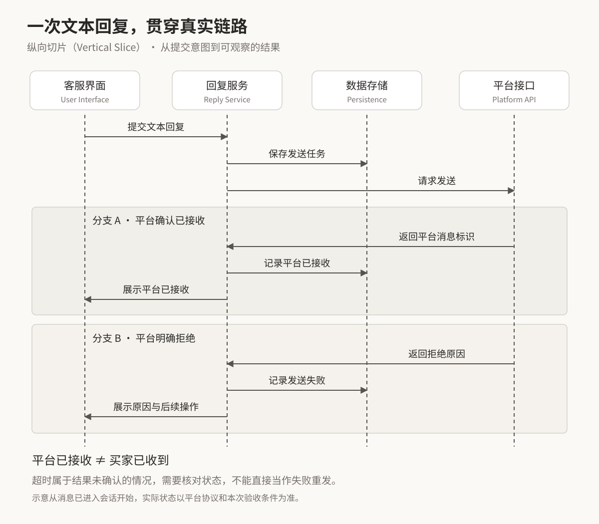
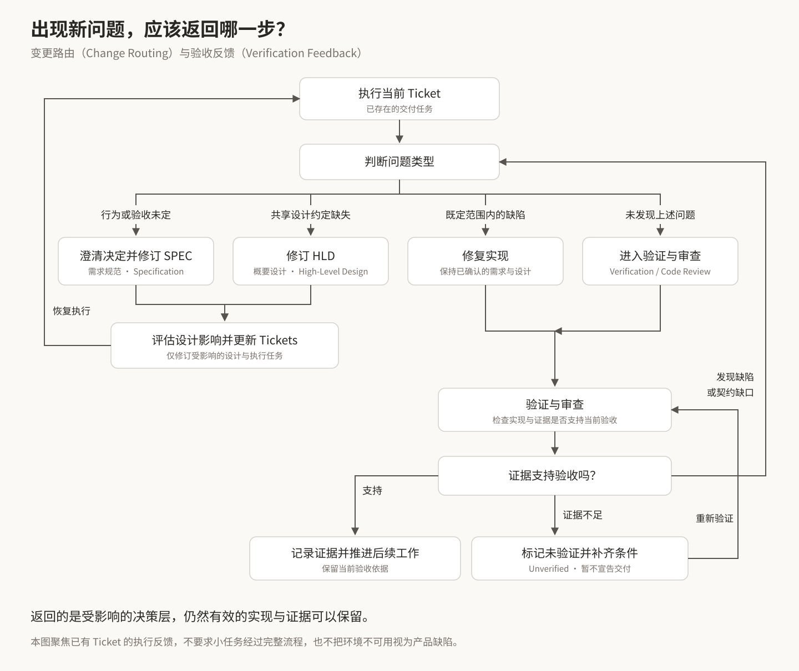

最近一段时间，我一直在改进自己的 Engineering Skills。最初只是想让 Coding Agent 在开始写代码之前，把需求问清楚，把任务拆得更合适，后来，需求规范、概要设计、任务执行、验证和审查逐渐都有了各自的约定，但我也开始遇到另一个问题：每次实际使用，总能找到值得补充的规则，整个工作流却因此越来越复杂。

这让我重新考虑，Engineering Skills 接下来应该往哪里发展。纵向切片（Vertical Slice）已经在我的使用中带来了明显收益，纯逻辑任务的执行边界也比单纯使用 Plan 模式更清楚，但涉及 Web、移动 App 和桌面客户端的图形界面（GUI），尤其是交互、样式与使用体验时，结果仍然很难稳定验收。继续增加 Skill、细化流程，是否就能解决这些问题？我现在没有这样的把握。

结合 Matt Pocock 的 Skills 设计，以及吴恩达最近发表的 AI Engineering Skills Map 系列，我打算从软件工程本身重新梳理这套工作流：哪些判断应该由人明确，哪些方法适合交给 Agent 重复执行，哪些结果必须拿到证据，流程又应该在哪里停止扩张。

本文记录的是这段实践形成的认识，其中有已经观察到的收益，也有下一步准备验证的方向，还不能把它们当成一套已经解决所有问题的方法。

## 写代码更快以后，工程判断影响了更多结果

吴恩达在 [Software engineering fundamentals](https://www.linkedin.com/pulse/ai-engineering-skills-map-software-fundamentals-andrew-ng-7lnac) 中强调，即使代码全部由 Agent 编写，开发者仍然需要理解软件基础，才能识别并引导延迟、可靠性、维护成本和复杂度之间的取舍（Trade-offs），如果不了解这些取舍，甚至不会意识到模型已经替自己做了决定。[^ng-fundamentals]

这与我使用 Agent 的感受很接近：过去，一项设计决定往往需要写相当多代码才能落地，实现过程也会迫使我反复检查它。现在 Agent 可以很快把一个设想铺到多个模块里，如果前提不准确，等我发现问题时，相关接口、测试和文档可能已经围绕这个前提建立起来。

例如，一个跨境电商客服系统需要处理买家消息，“收到一条消息就生成一条回复”看起来是清晰的实现要求，但买家可能连续发送几条消息，也可能在一条消息中同时问商品和物流。消息、意图、会话和处理任务之间的关系，直接决定数据模型、调度方式和用户体验，代码生成速度无法替我们回答这些业务问题。

从这个角度看，局部实现与长期设计需要同时照顾，修复眼前报错、补齐当前分支属于局部工作，而判断状态应该放在哪里、哪些概念需要分开、接口承担什么责任，则会影响后续一系列修改。Agent 可以参与两类工作，但我必须能识别它的建议会留下什么成本。

软件工程基础因此有了更具体的用途：让我知道什么时候可以直接实现，什么时候需要追问需求，什么时候值得做一次技术实验，以及什么时候应该拒绝一个看起来很完整的方案。

## Matt 的 Skills 给了我一个起点，也给了我一个约束

我的 [Engineering Skills](https://github.com/calvingit/skills) 以 Matt Pocock 的方案为行为基线，再适配自己的项目和协作方式。Matt 在 [Skills 仓库](https://github.com/mattpocock/skills) 中明确强调，小、容易修改、可以组合，是这套工具的设计取向，希望开发者保留对过程的控制。[^matt-skills]

我很认同这个取向，却在改进过程中逐渐偏离过它，`grilling` 就是一个例子：为了让 Agent 问得准确，我不断增加提问限制、分支规则和交接要求，文档一度超过三百行。每条规则单独看都有理由，合在一起以后，我却越来越难判断，哪些内容真正改善了访谈，哪些只是让指令看起来更加周全。

后来重新对照 Matt 的思路，我把注意力放回了几个核心动作：弄清目标和范围，找出影响结果的开放决策，先调查能查到的事实，再向用户提问，并根据回答继续追问，直到关键选择有了结论。具体的提问格式应当帮助用户作决定，不能反过来限制问题本身。

我仍然保留了适合自己工作流的调整，例如，一轮集中提出前置条件已经满足的问题，以减少来回沟通，同时把已经确认的决定及时写入文档，避免下一轮 Agent 重新猜测。如果涉及领域概念，就同步整理术语，并在必要时写下架构决策记录（Architecture Decision Record，ADR）。这些调整是为了让决定能够被后续工作使用，避免访谈结束后还要重新梳理结论。

这段经历也让我开始用同样的标准审视其他 Skill：它具体改善了哪一种失败，规则删掉之后会失去什么，使用者是否需要理解太多内部流程，才能完成一件本来简单的事？这些问题比 Skill 的数量更能帮助我判断改进方向。

## 先完成一个真实行为，再扩大实现范围

Matt 的 [to-tickets](https://github.com/mattpocock/skills/blob/main/skills/engineering/to-tickets/SKILL.md) 要求按纵向切片（Vertical Slice）拆分任务，让一个切片贯穿相关层，并能独立演示或验证。这个方法对我最直接的帮助，是让执行进度对应到可观察的行为。[^matt-tickets]

假设要实现客服消息回复，如果先完成数据库，再完成全部接口，最后接入界面，前几个阶段可以产生大量代码，却很难判断用户是否真的能完成一次回复。我打算先让一个明确场景跑通：收到某个平台的一条文本消息，在会话界面看到它，提交回复，并看到真实发送结果，让消息标识、平台接口、状态更新和界面反馈之间的连接在这条路径里接受检验。

**图 1：一次文本回复，就是一个可以跨层验证的切片。** 为了看清关键连接，下面从消息已经进入会话开始，省略接收消息的过程。



图中的“平台已接收”不等于“买家已收到”，超时后是否已经发送也需要单独确认，这些状态应当由平台实际协议决定。第一轮可以先验证正常路径，但交付时仍要覆盖本次验收要求中的失败与不确定状态，不能因为主流程跑通就直接宣布完成。

这里有两个目标需要分清：曳光弹式开发（Tracer Bullet）用最窄的真实端到端路径尽早验证技术连接与关键假设，而用于交付的纵向切片（Vertical Slice）则必须满足自己承诺的验收条件（Acceptance Criteria），所以前者证明路径可行，并不能自动证明功能已经可以交付。一个正常回复场景跑通后，失败提示、重试、重复提交等行为是否属于本次交付，仍要由已确认的范围决定。

相比只让 Agent 生成计划再逐项执行，纵向切片（Vertical Slice）在我的任务中提供了更清楚的边界：这一次必须做到什么，怎样证明它做到了，后续工作依赖哪一部分结果。这是实际使用中的观察，还没有经过严格的对照实验，不能据此认定所有项目都会获得同样的收益。

纵向切片（Vertical Slice）不要求每项任务都穿过数据库、接口和 UI，一个纯逻辑库应该围绕其公开行为切割，机械性迁移或必须同步修改的协议则需要依据真实依赖安排顺序。任务大小是否合适，要看能否获得有意义的反馈，而不能只看修改了多少个文件。

吴恩达在谈 Shaping the build 时，强调小批量交付，并根据用户反馈或技术实验决定下一步。[^ng-shaping] 我把它与纵向切片（Vertical Slice）放在一起理解：一个决定先通过有限实现接受检验，再据此决定是否继续扩展。技术链路跑通后，还应该尽早让实际使用者看到结果，避免在错误的产品假设上高效地完成整个计划。

## 统一语言（Ubiquitous Language）要贯穿需求、设计和代码

今天讨论得最多的另一个问题，是如何让领域内的统一语言（Ubiquitous Language）贯穿所有环节，使同一业务概念在需求、设计和代码中保持一致的含义。

在前面的客服例子里，如果需求中的“会话”表示买家与店铺的长期联系，而实现中的 `session` 表示一次短暂的 Agent 执行，那么“关闭会话”就存在两种完全不同的解释。即使每个模块都通过了自己的测试，整条业务流程仍然可能出错。

下面是一份用于说明问题的最小术语表，同一组概念会同时影响产品文案、代码命名和验收条件，具体定义仍需要由项目确认。

| 领域概念 | 英文名称 | 示例定义 | 对实现和验收的影响 |
| --- | --- | --- | --- |
| 会话 | Conversation | 买家与店铺之间持续存在的沟通记录 | 结束一次 Agent 执行，不应删除或关闭会话 |
| 消息 | Message | 平台接收或发送的一条内容 | 一条消息可能包含多个意图，不能直接等同于一个任务 |
| 回复任务 | Reply Task | 一次需要跟踪状态的回复处理 | 重试同一任务时，要检查是否可能重复发送 |
| 执行会话 | Agent Session | Agent 一次运行的上下文与执行过程 | 执行中断后，回复任务的进度仍需能够查回 |

这样讨论“关闭会话”时，就能先问清楚关闭的是 Conversation 还是 Agent Session，再判断要改业务状态还是停止执行，避免带着同一个中文名称进入两套不同的实现。

Matt 的 [domain-modeling](https://github.com/mattpocock/skills/blob/main/skills/engineering/domain-modeling/SKILL.md) 将领域建模（Domain Modeling）放在讨论过程中：用具体场景检验术语，发现冲突就澄清，概念确定后及时记录。[^matt-domain] 我打算沿着这个方向，让术语从需求访谈一直延续到 SPEC、设计、ticket、代码、测试和审查中。

统一语言（Ubiquitous Language）也有适用范围，同一个词可以在不同领域拥有不同含义，前提是上下文与转换关系清楚。强制整个仓库只能使用一套名称，可能会掩盖本来就不同的业务概念。代码中的旧名称也不能看到就改，应先确认它是否承担外部协议或兼容性义务。

我们还讨论过用准确术语引导 Agent：与其每次写一长段解释，不如在已有定义的基础上使用“纵向切片（Vertical Slice）”“深模块（Deep Module）”这样的概念。我把这种做法理解为减少表达歧义，而不把某个关键词当成能稳定触发模型能力的开关。术语后面仍然需要项目中的具体约定，不能用一个听起来专业的词替代需求。

因此，下一步更值得做的，是让项目清楚地提供术语表（Glossary）、领域模型（Domain Model）和架构决策的入口，并要求各环节在发现冲突时先解决冲突。没有必要为“每一步都读一下术语表”再建立一套独立流程。

## 深模块（Deep Module）控制的是调用者需要理解的复杂度

Agent 很容易生成结构整齐的代码，也容易生成大量接口、包装层和适配器，单看每个类，职责似乎都很明确，但真正调用时，却需要知道几个对象的创建顺序、状态同步方式和异常处理约定。

Matt 的 [codebase-design](https://github.com/mattpocock/skills/blob/main/skills/engineering/codebase-design/SKILL.md) 将深模块（Deep Module）理解为：通过较小的接口（Interface）提供较多行为，同时把复杂度留在模块内部。这里的接口包括调用者必须理解的约束和错误语义，不只是方法签名。[^matt-design]

例如，多平台消息发送模块可以在内部处理平台请求格式、鉴权和错误映射，让调用方围绕明确的发送意图及结果工作。但如果不同平台对“发送成功”的定义不同，接口就需要把这个差异表达出来，不能统一返回一个含义模糊的布尔值。信息隐藏（Information Hiding）成立的前提，是调用者仍然获得作出正确决定所需的信息。

**示例：把平台调用细节收进模块，把业务结果留在接口上。** 下面是用于比较设计的 TypeScript 伪代码，不对应某个平台的真实 SDK。

```typescript
// 调用方承担平台细节，各个入口都容易重复这段逻辑。
const token = await credentials.load(platform)
const payload = encodeForPlatform(platform, reply)
const raw = await transport.send(platform, token, payload)
const result = decodePlatformResult(platform, raw)

// 模块封装这些细节，调用方提交回复意图并处理明确的结果。
const result = await replySender.send({
  conversationId,
  text,
  replyTaskId,
})
```

第二种写法是否更好，还要看调用方能否正确理解返回值，例如下面的结果类型区分了平台接收、明确拒绝和暂时无法确认三种情况。

```typescript
type SendResult =
  | { status: 'accepted'; platformMessageId: string }
  | { status: 'rejected'; reason: string }
  | { status: 'unknown'; replyTaskId: string }
```

`unknown` 表示暂时无法确认发送结果，调用方应进入结果核对流程，不能直接当作失败重发。`replyTaskId` 用来关联同一次回复任务，它本身并不保证幂等性（Idempotency），模块仍需结合平台能力和持久化状态处理重复请求。这个接口隐藏了鉴权和数据转换，却保留了调用方必须知道的业务差异，深度也就体现在这里。

这也解释了我为什么逐渐重视 `simplify`，测试专用的注入点、转发包装、调试开关和兼容分支，在引入时可能都有合理用途，但当原来的使用场景消失，它们仍会影响后续理解和修改。是否保留，应当检查当前调用方与真实约束，不能因为“已经有了”就继续维护。

我打算把“最小必要复杂度（Minimum Necessary Complexity）”作为更稳定的判断标准，它允许为了清楚的模块边界进行必要调整，也要求删除已经被替代的实现，同时不能为了让 diff 更小，在旧逻辑旁边不断补分支，更不能为了假设中的复用提前铺设多层抽象。

## 完成标准要与证据对应，GUI 尤其如此

之前改进验证流程时，我最关心的问题逐渐从“有没有运行测试”变成了“这些测试究竟证明了什么”。实现者与验证者分开，可以减少相互影响，但如果两者共同接受了错误的验收前提，独立执行也无法让结论自动变得可靠。

我希望验证明确说明每项结论的依据：验收条件对应了什么检查，是否执行成功，证据是否足以支撑当前结论。测试被跳过、断言被削弱，或预期结果只是照着实现生成，都需要重新判断证据效力。失败与未验证也必须区分，环境无法启动，并不能证明产品行为错误，更不能写成验证通过。

验证（Verification）与代码审查（Code Review）因此各有关注点，前者回答某项验收是否成立、证据是否可信，后者还要关注设计、维护成本和回归风险。检查测试改动时，两者会有交集，但没有必要各自重复一遍完整审查。

这也决定了我打算交给 Agent 多大的自治范围（Agent Autonomy）：边界明确、结果可检查、失败能够恢复的任务，适合让它连续推进，证据不足或下一步需要新的产品取舍时，就需要重新判断。长时间运行和大量消耗 token 都只是执行过程，不能代替交付价值。自治范围应随着验证能力扩大，而不能仅凭模型自报的信心扩大。

图形用户界面（Graphical User Interface，GUI）是我目前最难稳定处理的部分，按钮能点击、接口返回成功、页面跳转正确，只覆盖了部分质量，至于信息层级是否清楚、加载时是否跳动、错误出现后用户是否知道怎样继续，都需要额外观察。

接下来，我打算把界面验收拆成几类明确的检查，而不是继续增加笼统的“确保体验良好”：

| 验收内容 | 更合适的证据 | 不能据此直接推断 |
| --- | --- | --- |
| 业务行为与状态转换 | 单元、集成测试及关键端到端测试（End-to-End Testing，E2E）场景 | 页面视觉质量已经合格 |
| 布局、字体与关键状态 | 指定尺寸和数据下的渲染截图、视觉对比 | 整个交互过程自然顺畅 |
| 操作反馈与异常恢复 | 浏览器或真机实际操作、录屏、人工体验 | 所有设备与用户场景均已覆盖 |

仍以发送失败为例，一次 E2E 检查可以证明错误提示出现、输入内容保留、后续操作可触发，但截图可能暴露提示被软键盘遮挡，实际操作还可能发现用户根本分不清“重试”和“重新发送”的区别。三种检查观察的是同一场景的不同问题，即使第一项通过，后两项也不能直接写成合格。

这是一条准备继续验证的方向，我还没有一套足够成熟、能够覆盖不同前端技术栈的 GUI 验收方案。当前能做的，是在任务开始时明确参考设计、关键状态和检查条件，交付时如实说明检查覆盖到哪里。

吴恩达在 [Building and Deploying AI Applications](https://www.linkedin.com/pulse/ai-engineering-skills-map-building-deploying-applications-andrew-ng-gyn5e) 中强调，通过评估（Evaluation）与错误分析（Error Analysis）决定下一步，并检查评估方法本身是否合适。[^ng-apps] 这给了我一个有用的参照：GUI 的质量判断虽不等同于模型评估，但同样需要选择与目标匹配的证据，不能让最容易自动化的检查代替全部质量要求。

## 工作流需要边界，也需要允许返回

Engineering Skills 的持续改进中，一部分工作是拆清文档职责：需求写入需求规范（Specification，SPEC），跨多处实现共享的设计约定按需写入概要设计（High-Level Design，HLD），任务单（Ticket）描述可执行的交付任务，执行过程留下进度与证据。当前仓库明确区分这些职责，让问题出现时能够找到需要修正的那一层。[^engineering-skills]

例如，实现中发现“取消”到底意味着停止本地等待，还是终止已经提交的平台操作，这属于尚未解决的行为选择，继续编码只会把一个未经确认的答案写进系统，因此应先明确需求，再检查设计与任务安排受到了哪些影响。已经完成且仍然有效的工作不需要全部重来，但原有证据也不能自动覆盖新的要求。

**图 2：返回哪一步，取决于新问题改变了什么。** 这张图聚焦已有 ticket 的执行与反馈，不表示每个任务都要先走完整套流程。



例如，“取消只停止本地等待”变成“必须终止平台操作”，就需要回到需求与设计检查可行性，而已经明确取消语义、只是按钮没有触发对应逻辑，通常可以直接修复实现。若平台测试环境不可用，应记录缺少哪项证据，不能把它归为产品缺陷，也不能跳过检查继续宣告交付。

一个明确的小修复不值得经过整套流程，是否需要 HLD，取决于有没有多处实现必须共同遵守的设计约定，是否需要拆 ticket，则取决于工作规模和依赖是否需要管理。文档应当解决交接问题，不能仅因为流程图里有这个方框，就要求每个任务填写一份。

多 Agent 的使用也需要类似的取舍，我曾希望每张 ticket 都交给全新的 Agent，实际执行却遇到了启动、重复读取上下文和重新搜索代码的成本。我的部分任务中，多 Agent 流程甚至比串行明显更慢，这个经历不能证明串行普遍更好，但足以让我放弃“任务越多，Agent 就应该越多”的默认假设。

我现在更看重独立调查、独立审查，以及确实能够隔离的并行任务。后一个任务直接依赖前一个任务的实现时，保持上下文连续往往更自然。是否并行，应当比较收益与协调成本，同时也要明确工作流与运行时（Runtime）的职责，尽量复用后者已经提供的会话恢复和上下文压缩机制。

吴恩达在 [Using coding agents](https://www.linkedin.com/pulse/ai-engineering-skills-map-using-coding-agents-andrew-ng-h8yxc) 中将 Agent 开发描述为迭代过程：规划、执行与上线监控之间可以根据反馈返回，投入程度和自治程度需要按任务调整。他也明确谈到，过时的 Skills 应当清理。[^ng-agents] 这与我现在的方向一致：先观察问题，再调整流程，并保留撤掉无效规则的余地。

## 用一组稳定原则约束后续改进

在这些实践之上，我打算为 Engineering Skills 保留五条共同原则：统一语言（Ubiquitous Language）、纵向切片（Vertical Slice）与尽早验证、深模块（Deep Module）与信息隐藏（Information Hiding）、基于证据判断完成（Evidence-Based Completion），以及最小必要复杂度（Minimum Necessary Complexity）。它们应该在不同环节持续起作用，不必各自扩展成一个新的 Skill。

具体落地时，我打算让用户级 `AGENTS.md` 表达跨项目的工程偏好，由项目级 `AGENTS.md` 和相关文档提供术语、架构、验证方法与权威来源，再由 Skill 描述解决某类问题的方法。`project-setup` 可以帮助确认并记录稳定入口，具体约定仍然应当留在项目里。

例如，通用原则可以要求完成声明必须有证据，前端项目则需要进一步说明哪些检查必须在目标浏览器或设备上完成、哪些平台暂时没有覆盖。同样，通用原则可以要求沿用领域术语，具体的“会话”“消息”“回复任务”如何定义，则必须由这个项目决定。把两类信息混在一个通用 Skill 里，会让它越来越难复用，也容易在别的项目中误用。

| 放在哪里 | 回答的问题 | 具体示例 |
| --- | --- | --- |
| 工程原则（Engineering Principles） | 不同任务共同遵守什么判断标准？ | 完成声明必须有证据，行为测试通过不能直接证明视觉质量合格 |
| 项目上下文（Project Context） | 当前项目有哪些事实和约束？ | Conversation 的定义、GUI 检查的平台与设备范围、现有测试命令 |
| 工程活动（Engineering Activity） | 遇到某类问题时，如何推进并产出结果？ | `grilling` 澄清开放决策，`to-tickets` 拆分可验证的交付任务 |

如果问题是 Agent 不知道前端项目怎样在目标环境中启动并执行 GUI 检查，先补齐项目入口就可能足够，如果问题是多次把截图检查误认为完整的体验验收，就需要明确证据适用范围。只有出现需要反复执行、且有清晰边界的方法时，才值得进一步考虑新增 Skill。

以后遇到一种值得借鉴的方法，我会先判断它应该放在哪里，把跨任务持续适用的判断标准写入工程原则，把只对当前代码库成立的事实与限制写入项目上下文，只有具备明确触发条件、执行方法和产出的独立活动，才考虑做成 Skill。Engineering Skills 可以承载一部分工程经验，但没有必要把所有软件工程知识都重新整理进来。

后续每次改进，我打算留下足够简单的比较：原来的流程在哪类任务中失败，调整后是否减少返工，是否增加无效追问，是否降低重复读取成本，交付结果能否更容易核查。模型和 Runtime 更新后，再检查原来的规则是否仍然有用。没有证据说明收益的改动，可以先作为尝试，没必要立即变成长期规范。

吴恩达在 [Shaping the build](https://www.linkedin.com/pulse/ai-engineering-skills-map-shaping-build-andrew-ng-td7uc) 中把推动开发反馈循环（Feedback Loop）、产品判断、沟通和主动承担结果纳入工程师的能力范围。[^ng-shaping] 这也让我更清楚自己维护这些 Skills 的目的：把可重复的方法交给 Agent，让我有更多精力理解用户、检查取舍，并根据实际反馈决定下一步。

Engineering Skills 不需要覆盖软件开发的每一个环节，才算有价值。对我而言，当前已经有效的纵向切片（Vertical Slice）值得保留，术语与证据需要继续贯穿流程，GUI 验收则需要更多真实项目中的尝试。下一次修改是否值得做，最终还是要回到具体任务：它有没有让需求更清楚、让问题更早暴露，或者让交付结果更可信。

## 参考资料

以下外部资料核对于 2026 年 9 月 20 日。Matt 的部分 Skills 路径及内容会随仓库演进，文中采用其公开文档作为观点依据。Engineering Skills 的历史调整与使用感受来自我的实践，文中的客服场景用于解释方法，不代表已经交付的产品功能。

[^matt-skills]: Matt Pocock，[Skills for Real Engineers](https://github.com/mattpocock/skills)。小型、可修改、可组合的 Skills 设计取向。
[^matt-tickets]: Matt Pocock，[to-tickets](https://github.com/mattpocock/skills/blob/main/skills/engineering/to-tickets/SKILL.md)。纵向切片（Vertical Slice）、独立验证和真实依赖。
[^matt-domain]: Matt Pocock，[domain-modeling](https://github.com/mattpocock/skills/blob/main/skills/engineering/domain-modeling/SKILL.md)。讨论中的领域建模、术语澄清与决策记录。
[^matt-design]: Matt Pocock，[codebase-design](https://github.com/mattpocock/skills/blob/main/skills/engineering/codebase-design/SKILL.md)。深模块（Deep Module）、接口负担与信息隐藏（Information Hiding）。
[^ng-fundamentals]: Andrew Ng，[AI Engineering Skills Map: Software engineering fundamentals](https://www.linkedin.com/pulse/ai-engineering-skills-map-software-fundamentals-andrew-ng-7lnac)，2026-08-28。
[^ng-apps]: Andrew Ng，[AI Engineering Skills Map: Building and Deploying AI Applications](https://www.linkedin.com/pulse/ai-engineering-skills-map-building-deploying-applications-andrew-ng-gyn5e)，2026-08-21。
[^ng-agents]: Andrew Ng，[AI Engineering Skills Map: Using coding agents](https://www.linkedin.com/pulse/ai-engineering-skills-map-using-coding-agents-andrew-ng-h8yxc)，2026-09-04。
[^ng-shaping]: Andrew Ng，[AI Engineering Skills Map: Shaping the build](https://www.linkedin.com/pulse/ai-engineering-skills-map-shaping-build-andrew-ng-td7uc)，2026-09-11。
[^engineering-skills]: Calvin，[Engineering Skills](https://github.com/calvingit/skills)。本文涉及的个人工作流及职责划分。

系列总览：[Andrew Ng — The AI Engineering Skills Map](https://www.linkedin.com/pulse/ai-engineering-skills-map-andrew-ng-m479c)，2026-08-14。

相关旧文：[《我的 AI Coding 工作流（四）：感悟篇》](https://zhangwen.site/ai-coding-workflow-4/)、[《Harness Engineering：Agent-First 时代的软件工程实践》](https://zhangwen.site/harness-engineering-agent-first/)。
